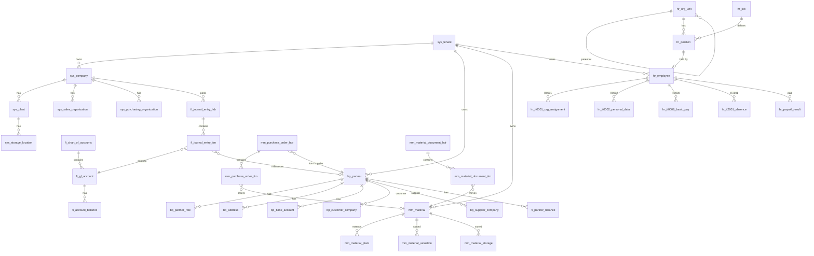
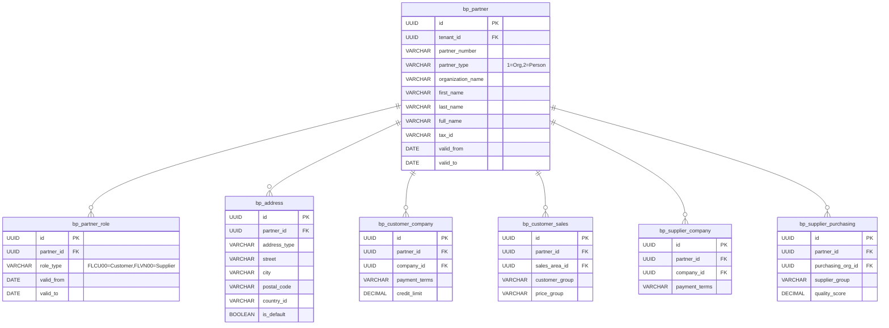
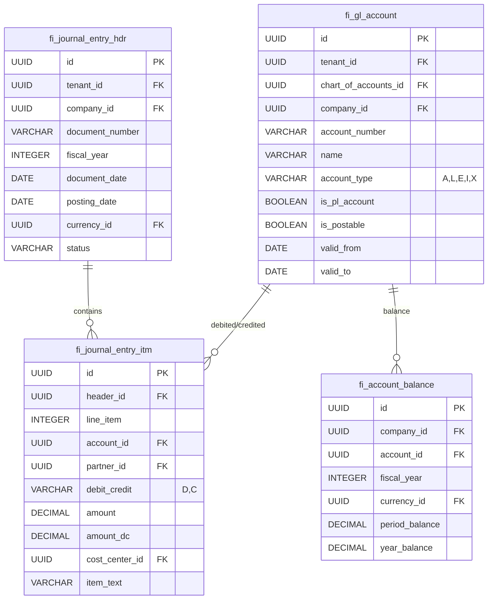
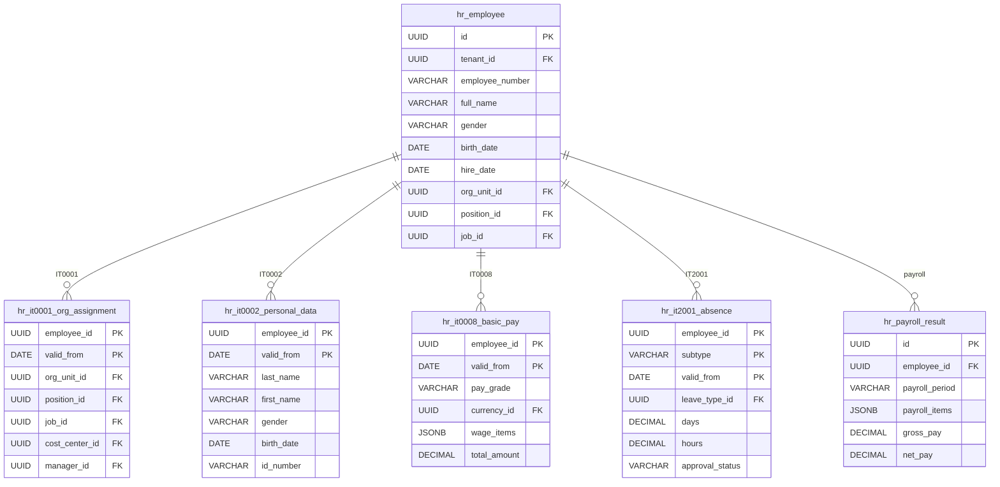
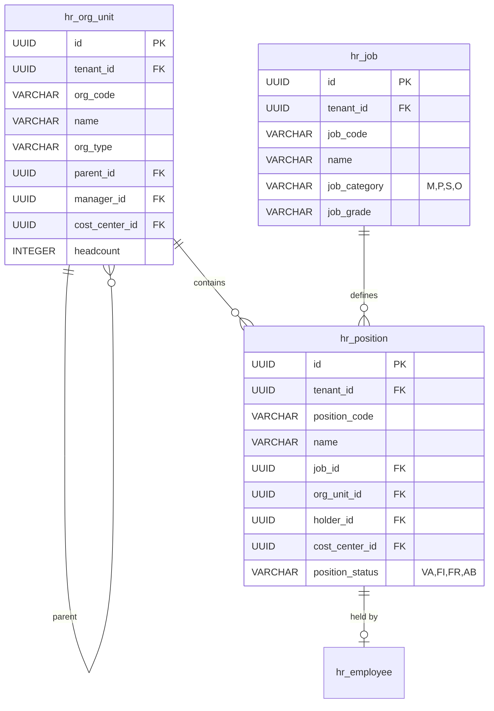
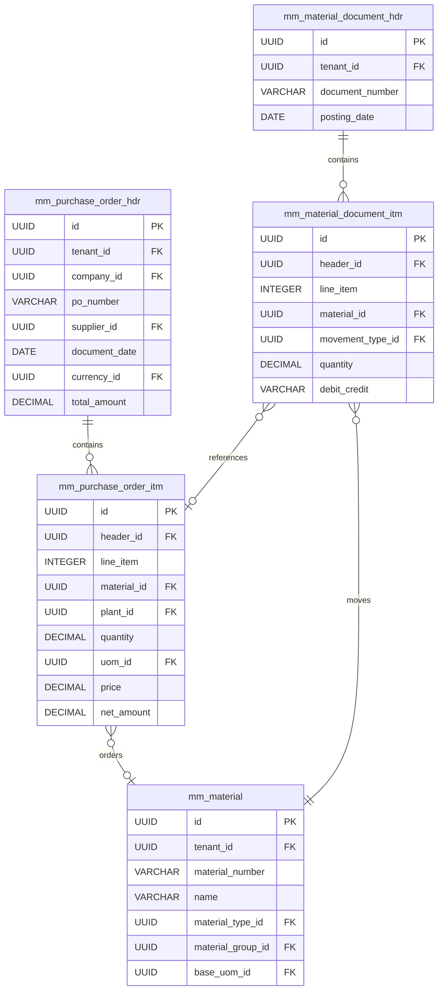

# NextERP 数据库 ER 图

## 核心模块关系图

## 业务伙伴模型

## 财务会计模型

## HR 信息类型模型

## 组织架构模型

## 采购模型

## 表统计

| 模块 | 表数量 | 主要表 |
|------|--------|--------|
| Core | 8 | core_currency, core_uom, core_country |
| Tenant | 12 | sys_tenant, sys_company, sys_plant |
| BP | 10 | bp_partner, bp_address, bp_customer_company |
| FI/CO | 10 | fi_gl_account, fi_journal_entry_hdr |
| MM | 14 | mm_material, mm_purchase_order_hdr |
| HR | 18 | hr_employee, hr_it0001, hr_payroll_result |
| **总计** | **72** | |
