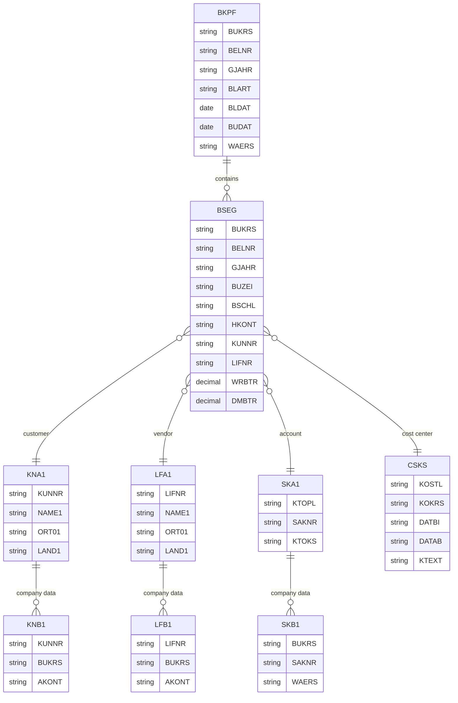

# SAP ECC 6.0 - FI/CO 模块数据库设计

## 概述

SAP FI (财务会计) 和 CO (管理会计) 是 ERP 系统的核心模块，负责外部会计和内部成本控制。

## 模块组成

| 子模块 | 代码 | 说明 |
|--------|------|------|
| 总账 | GL | 总分类账会计 |
| 应收账款 | AR | 客户会计 |
| 应付账款 | AP | 供应商会计 |
| 资产会计 | AA | 固定资产管理 |
| 银行会计 | BL | 银行对账 |
| 基金管理 | FM | 预算管理 |
| 成本控制 | CO | 管理会计 |

## 核心表清单

### 总账 (GL)

#### 凭证表

| 表名 | 说明 |
|------|------|
| BKPF | 会计凭证头 |
| BSEG | 会计凭证段 (聚簇表) |
| BSET | 凭证税数据 |
| BSET | 凭证税数据 (含聚簇) |

#### 科目表

| 表名 | 说明 |
|------|------|
| SKA1 | 总账科目主记录 (科目表) |
| SKAT | 总账科目主记录 (描述) |
| SKB1 | 总账科目主记录 (公司代码) |
| GLT0 | 总账科目余额 (经典) |
| FAGLFLEXT | 新总账汇总表 |

#### 主数据表

| 表名 | 说明 |
|------|------|
| T001 | 公司代码 |
| T001K | 评估范围 |
| T001L | 库存地点 |
| T004 | 科目表 |
| T006 | 计量单位 |
| T009 | 会计年度变式 |
| T014 | 凭证类型 |
| T077S | 科目类型 |
| T880 | 全球公司 |

### 应收账款 (AR)

#### 客户主数据

| 表名 | 说明 |
|------|------|
| KNA1 | 客户主数据通用部分 |
| KNB1 | 客户主数据公司代码部分 |
| KNB5 | 客户催款数据 |
| KNC1 | 客户余额 (按会计年度) |
| KNC2 | 客户余额 (按期间) |
| KNKK | 客户信贷管理 |
| KNVP | 客户合作伙伴功能 |

#### 客户交易数据

| 表名 | 说明 |
|------|------|
| BSID | 应收未清项 |
| BSAD | 应收已清项 |
| BSE_CLR | 清算信息 |

### 应付账款 (AP)

#### 供应商主数据

| 表名 | 说明 |
|------|------|
| LFA1 | 供应商主数据通用部分 |
| LFB1 | 供应商主数据公司代码部分 |
| LFB5 | 供应商催款数据 |
| LFC1 | 供应商余额 (按会计年度) |
| LFC2 | 供应商余额 (按期间) |
| LFM1 | 供应商主数据采购组织部分 |
| LFM2 | 供应商主数据采购组织部分 2 |

#### 供应商交易数据

| 表名 | 说明 |
|------|------|
| BSIK | 应付未清项 |
| BSAK | 应付已清项 |

### 资产会计 (AA)

#### 资产主数据

| 表名 | 说明 |
|------|------|
| ANLA | 资产主数据段 |
| ANLB | 折旧条款 |
| ANLC | 资产值字段 |
| ANEP | 资产行项目 |
| ANKT | 资产描述 |
| ANLU | 附加资产数据 |

#### 折旧表

| 表名 | 说明 |
|------|------|
| T093 | 折旧范围 |
| T094 | 折旧码 |
| T095 | 折旧范围定义 |
| T096 | 折旧类型 |
| T090 | 资产分类 |
| T091 | 资产分类描述 |
| T091A | 资产分类屏幕布局 |

### 银行会计 (BL)

| 表名 | 说明 |
|------|------|
| BNKA | 银行主数据 |
| LFBK | 供应商银行明细 |
| KNBK | 客户银行明细 |
| FEBKO | 银行流水头 |
| FEBEP | 银行流水项 |
| FEBA | 银行对账单 |
| FEBRE | 银行对账 |

### 成本控制 (CO)

#### 成本要素

| 表名 | 说明 |
|------|------|
| CSLA | 成本中心主记录 |
| CSKS | 成本中心主数据 |
| CSKT | 成本中心文本 |
| CEPCT | 利润中心主数据 |
| CEPC | 利润中心文本 |
| SETHEADER | 组头 |
| SETNODE | 组节点 |

#### 成本对象

| 表名 | 说明 |
|------|------|
| COAS | 内部订单主数据 |
| AUFK | 订单主记录 |
| PRPS | WBS 元素主数据 |
| PROJ | 项目定义 |

#### 成本数据

| 表名 | 说明 |
|------|------|
| COEP | 成本控制行项目 |
| COEJ | 成本控制期间总计 |
| COSP | 成本控制总计 |
| COSS | 成本控制总计 (内部) |
| COOI | 成本控制对象: 订单 |
| COKA | 分配规则 |

#### 利润分析

| 表名 | 说明 |
|------|------|
| CE1xxxx | 盈利分析段 (客户特定) |
| CE2xxxx | 盈利分析段 (客户特定) |
| CE3xxxx | 盈利分析段 (客户特定) |
| CE4xxxx | 盈利分析段 (客户特定) |

## BKPF (会计凭证头) 完整字段

```sql
-- BKPF 主要字段
MANDT      MANDT           -- 集团
BUKRS      BUKRS           -- 公司代码
BELNR      BELNR_D         -- 会计凭证号
GJAHR      GJAHR           -- 会计年度
BLART      BLART           -- 凭证类型
BLDAT      BLDAT           -- 凭证日期
BUDAT      BUDAT           -- 过账日期
MONAT      MONAT           -- 期间
CPUTM      CPUTM           -- 输入时间
USNAM      USNAM           -- 用户名
TCODE      TCODE           -- 事务代码
BVORG      BVORG           -- 组织 ID
XAABV      XAABV           -- 会计标识
CURT2      CURT2           -- 第二本位币
WAERS      WAERS           -- 货币
KURSF      KURSF           -- 汇率
KZWRS      KZWRS           -- 硬通货
KZKRS      KZKRS           -- 硬通货汇率
WWERT      WWERT           -- 估值日期
WWTTY      WWTTY           -- 估值类型
XBLNR      XBLNR1          -- 参考号
DBBLG      DBBLG           -- 复核标识
STBLG      STBLG           -- 反冲凭证
STJAH      STJAH           -- 反冲年度
BKTXT      BKTXT           -- 凭证头文本
WAERS2     WAERS           -- 第二本位币
KURS2      KURSF           -- 第二本位币汇率
XMWST      XMWST           -- 税额标识
CURTP      CURTP           -- 货币类型
XSNET      XSNET           -- 净额标识
FRATH      FRATH           -- 转换因子
XWVOF      XWVOF           -- 值日期标识
NUMPG      NUMPG           -- 页数
AEDAT      AEDAT           -- 更改日期
UPDDT      UPDDT           -- 更新日期
PPNAM      PPNAM           -- 预制人
PPNAM2     PPNAM2          -- 预制人 2
BRNCH      BRNCH           -- 分支
BATCH      BATCH           -- 批量输入会话
BSTAT      BSTAT           -- 凭证状态
XCNTR      XCNTR           -- 转换标识
XREF1_HD   XREF1_HD        -- 参考键 1
XREF2_HD   XREF2_HD        -- 参考键 2
GLVOR      GLVOR           -- 业务交易
DEPRS      DEPRS          -- 折旧运行
```

## BSEG (会计凭证段) 完整字段

```sql
-- BSEG 主要字段
MANDT      MANDT           -- 集团
BUKRS      BUKRS           -- 公司代码
BELNR      BELNR_D         -- 会计凭证号
GJAHR      GJAHR           -- 会计年度
BUZEI      BUZEI           -- 行项目

-- 会计字段
BSCHL      BSCHL           -- 记账码
KOART      KOART           -- 科目类型
SHKZG      SHKZG           -- 借/贷标识
MWSKZ      MWSKZ           -- 税码
QAUSG      QAUSG           -- 差异代码
TXGRP      TXGRP           -- 税组
KTOSL      KTOSL           -- 交易代码

-- 科目信息
HKONT      HKONT           -- 总账科目
SAKNR      SAKNR           -- 总账科目
KUNNR      KUNNR           -- 客户号
LIFNR      LIFNR           -- 供应商号

-- 金额字段
WRBTR      WRBTR8          -- 金额 (交易货币)
DMBTR      DMBTR           -- 金额 (本位币)
PSWBT      PSWBT           -- 金额 (第二货币)
PSWSL      PSWSL           -- 第二货币
WMWST      WMWST           -- 税额 (交易货币)
MWSTS      MWSTS           -- 税额 (本位币)

-- 组织字段
GSBER      GSBER           -- 业务范围
PRCTR      PRCTR           -- 利润中心
KOSTL      KOSTL           -- 成本中心
AUFNR      AUFNR           -- 订单号
PROJK      PROJK_N         -- WBS 要素
BUKRS      BUKRS           -- 公司代码

-- 物料字段
MATNR      MATNR           -- 物料号
WERKS      WERKS_D         -- 工厂
MENGE      MENGE_D         -- 数量
MEINS      MEINS           -- 单位

-- 日期字段
ZFBDT      ZFBDT           -- 基准日期
ZUONR      ZUONR           -- 分配号
SGTXT      SGTXT           -- 文本

-- 参考
VBUND      VBUND           -- 贸易伙伴
XREF1      XREF1           -- 参考键 1
XREF2      XREF2           -- 参考键 2
XREF3      XREF3           -- 参考键 3
REBZG      REBZG           -- 参考凭证
REBZJ      REBZJ           -- 参考年度
REBZZ      REBZZ           -- 参考项目
ZINKZ      ZINKZ           -- 利息标识
FIPOS      FIPOS           -- 承诺项目

-- 税务
QSCHL      QSCHL           -- 预提税码
MSCHL      MSCHL           -- 税组
HKONT_L    HKONT           -- 目标科目

-- 清算
AUGDT      AUGDT           -- 清算日期
AUGBL      AUGBL           -- 清算凭证
AUGGJ      AUGGJ           -- 清算年度
```

## SKA1 (总账科目主记录-科目表) 完整字段

```sql
-- SKA1 主要字段
MANDT      MANDT           -- 集团
KTOPL      KTOPL           -- 科目表
SAKNR      SAKNR           -- 总账科目号
XLOEV      XLOEV           -- 删除标识
XSPEB      XSPEB           -- 冻结标识
KTOKS      KTOKS           -- 科目组
GVTYP      GVTYP           -- 损益表类型
XBILK      XBILK           -- 资产负债表科目
FSTAG      FSTAG           -- 字段状态组
XKRES      XKRES           -- 是否可过账
XGKRE      XGKRE           -- 科目组
XOPVW      XOPVW           -- 未清项管理
XINTB      XINTB           -- 是否自动过账
XNSOA      XNSOA           -- 不含统计指标
MCOD1      MCOD1           -- 搜索项 1
MCOD2      MCOD2           -- 搜索项 2
MCOD3      MCOD3           -- 搜索项 3
FRWHR      FRWHR           -- 允许过账货币
WAERS      WAERS           -- 货币
MWSKZ      MWSKZ           -- 税类别
KATYP      KATYP           -- 成本要素类别
KAZNR      KAZNR           -- 来源组
KAZID      KAZID           -- 来源 ID
KZWRS      KZWRS           -- 硬通货
```

## 表关系图



## 查询示例

### 获取凭证明细

```sql
-- 获取凭证头信息
SELECT BUKRS, BELNR, GJAHR, BLART, BLDAT, BUDAT, WAERS
FROM BKPF
WHERE BUKRS = '1000'
  AND BELNR = '100000001'
  AND GJAHR = '2024';

-- 获取凭证行项目
SELECT BUZEI, BSCHL, HKONT, KUNNR, LIFNR,
       SHKZG, WRBTR, DMBTR, SGTEXT
FROM BSEG
WHERE BUKRS = '1000'
  AND BELNR = '100000001'
  AND GJAHR = '2024';
```

### 获取客户余额

```sql
-- 使用聚合表 (ECC)
SELECT KUNNR, UMS01, UMS02, UMS03, UMS04
FROM KNC1
WHERE BUKRS = '1000'
  AND GJAHR = '2024';

-- 使用未清项计算
SELECT KUNNR,
       SUM(CASE WHEN SHKZG = 'S' THEN WRBTR ELSE -WRBTR END) AS BALANCE
FROM BSID
WHERE BUKRS = '1000'
  AND BUDAT <= '20241231'
GROUP BY KUNNR;
```

### 获取科目余额

```sql
-- 使用聚合表
SELECT SAKNR, HSL01, HSL02, HSL03, HSL04
FROM GLT0
WHERE BUKRS = '1000'
  AND RYEAR = '2024'
  AND RACCT = '0011000000';
```

## 参考资源

- SAP FI/CO 表参考: https://www.leanx.eu/en/sap-tables/fi
- SAP Help - Financial Accounting: https://help.sap.com/docs/SAP_S4HANA_ON-PREMISE
