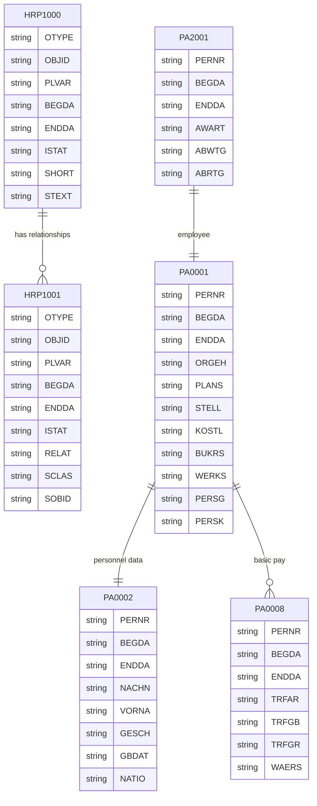

# SAP ECC 6.0 - HR/HCM 模块数据库设计

## 概述

SAP HR/HCM (Human Capital Management) 模块采用独特的 **信息类型 (Infotype)** 架构，每个信息类型对应一个数据库表 `PAnnnn`。

## 核心表清单

### 信息类型表 (Infotype Tables)

所有信息类型表都遵循命名规范 `PAnnnn`，其中 `nnnn` 是4位数字的信息类型编号。

#### 组织管理 (OM) - 客户端独立表

| 信息类型 | 表名 | 说明 |
|---------|------|------|
| IT1000 | HRP1000 | 对象基础信息 |
| IT1001 | HRP1001 | 对象关系 |
| IT1002 | HRP1002 | 描述文本 |
| IT1003 | HRP1003 | 部门/职位状态 |
| IT1005 | HRP1005 | 任务限定符 |
| IT1006 | HRP1006 | 限制/约束 |
| IT1007 | HRP1007 | 执行计划 |
| IT1008 | HRP1008 | 会计影响 |
| IT1010 | HRP1010 | 锁定指示符 |
| IT1011 | HRP1011 | 工作地点 |
| IT1013 | HRP1013 | 集团分配 |
| IT1014 | HRP1014 | 有效性 |
| IT1015 | HRP1015 | 替代 |
| IT1016 | HRP1016 | 部门标识符 |
| IT1017 | HRP1017 | 劳动协议 |
| IT1018 | HRP1018 | 培训需求 |

#### 组织管理 (OM) - 客户端依赖表

| 信息类型 | 表名 | 说明 |
|---------|------|------|
| IT1000 | HRT1000 | 对象基础信息 (客户端依赖) |
| IT1001 | HRT1001 | 对象关系 (客户端依赖) |

#### 人事行政 (PA) - 核心信息类型

| 信息类型 | 表名 | 说明 | 必填 |
|---------|------|------|------|
| IT0000 | PA0000 | 措施 (Actions) | ✓ |
| IT0001 | PA0001 | 组织分配 (Org Assignment) | ✓ |
| IT0002 | PA0002 | 个人数据 (Personal Data) | ✓ |
| IT0003 | PA0003 | 工资状态 (Payroll Status) | ✓ |
| IT0004 | PA0004 | 挑战 (Challenges) | |
| IT0005 | PA0005 | 纪念日 (Dates) | |
| IT0006 | PA0006 | 地址 (Address) | |
| IT0007 | PA0007 | 工作计划规则 (Planned Working Time) | |
| IT0008 | PA0008 | 基本工资 (Basic Pay) | |
| IT0009 | PA0009 | 银行明细 (Bank Details) | |
| IT0010 | PA0010 | 竞业禁止 (Competitive Clauses) | |
| IT0011 | PA0011 | 外部数据传输 (External Data Transfer) | |
| IT0012 | PA0012 | 费用报销 (Cost Distribution) | |
| IT0014 | PA0014 | 经常性支付/扣减 (Recurring Payments/Deductions) | |
| IT0015 | PA0015 | 附加支付 (Additional Payments) | |
| IT0016 | PA0016 | 合同要素 (Contract Elements) | |
| IT0017 | PA0017 | 旅行费用 (Travel Expenses) | |
| IT0019 | PA0019 | 任务监控 (Task Monitoring) | |
| IT0020 | PA0020 | 记忆 (Memos) | |
| IT0021 | PA0021 | 家庭成员 (Family) | |
| IT0022 | PA0022 | 教育 (Education) | |
| IT0023 | PA0023 | 其他/以前的雇主 (Other/Previous Employer) | |
| IT0024 | PA0024 | 资质 (Qualifications) | |
| IT0025 | PA0025 | 评估 (Appraisals) | |
| IT0026 | PA0026 | 医疗检查 (Health Examinations) | |
| IT0027 | PA0027 | 成本分配 (Cost Distribution) | |
| IT0028 | PA0028 | 内部医疗 (Internal Medicine) | |
| IT0029 | PA0029 | 退休金 (Pension) | |
| IT0030 | PA0030 | 罚款 (Penalties) | |
| IT0031 | PA0031 | 引用编号 (Reference Personnel Numbers) | |
| IT0032 | PA0032 | 工资会计数据 (Payroll Data) | |
| IT0034 | PA0034 | 企业措施 (Corporate Measures) | |
| IT0035 | PA0035 | 应征 (Conscription) | |
| IT0036 | PA0036 | 家庭信息 (Family Information) | |
| IT0037 | PA0037 | 保险 (Insurance) | |
| IT0041 | PA0041 | 日期说明符 (Date Specifications) | |
| IT0042 | PA0042 | 证券 (Securities) | |
| IT0043 | PA0043 | 存款 (Deposits) | |
| IT0044 | PA0044 | 附加税 (Supplementary Tax) | |
| IT0045 | PA0045 | 贷款 (Loans) | |
| IT0046 | PA0046 | 居留许可 (Residence Permit) | |
| IT0047 | PA0047 | 存档 (Archiving) | |
| IT0048 | PA0048 | 继承人 (Heirs) | |
| IT0049 | PA0049 | 董事会成员 (Board Members) | |
| IT0050 | PA0050 | 失业 (Unemployment) | |
| IT0052 | PA0052 | 工资/薪水 (Wage/Salary) | |
| IT0053 | PA0053 | 工资会计结果 (Payroll Results) | |
| IT0054 | PA0054 | 缴费 (Payments) | |
| IT0055 | PA0055 | 档案 (Archives) | |
| IT0056 | PA0056 | 信任 (Trust) | |
| IT0057 | PA0057 | 成员资格 (Membership) | |
| IT0058 | PA0058 | 伤病 (Injury) | |
| IT0059 | PA0059 | 监护 (Guardianship) | |
| IT0061 | PA0061 | 退休福利 (Pension Benefits) | |
| IT0062 | PA0062 | 车辆 (Vehicles) | |
| IT0063 | PA0063 | 利润分享 (Profit Sharing) | |
| IT0064 | PA0064 | 税收模型 (Tax Model) | |
| IT0065 | PA0065 | 养老金 (Pension Fund) | |
| IT0066 | PA0066 | 班组 (Shift Groups) | |
| IT0067 | PA0067 | 福利 (Welfare) | |
| IT0068 | PA0068 | 离职金 (Severance Pay) | |
| IT0069 | PA0069 | 退休计划 (Retirement Plan) | |
| IT0070 | PA0070 | 消费者贷款 (Consumer Loan) | |
| IT0071 | PA0071 | 员工分享计划 (Employee Share Scheme) | |
| IT0073 | PA0073 | 社会保险 (Social Insurance) | |
| IT0074 | PA0074 | 股票期权 (Stock Options) | |
| IT0075 | PA0075 | 养老金 (Pension) | |
| IT0077 | PA0077 | 附加个人数据 (Additional Personal Data) | |
| IT0078 | PA0078 | 工资保护 (Wage Protection) | |
| IT0080 | PA0080 | 培训 (Training) | |
| IT0081 | PA0081 | 安全许可 (Security Clearance) | |
| IT0082 | PA0082 | 附加个人数据 2 (Additional Personal Data 2) | |
| IT0083 | PA0083 | 离职金计算 (Severance Pay Calculation) | |
| IT0084 | PA0084 | 绩效 (Performance) | |
| IT0085 | PA0085 | 基础 (Base) | |
| IT0086 | PA0086 | 额外休假 (Additional Leave) | |
| IT0087 | PA0087 | 预扣税 (Withholding Tax) | |
| IT0088 | PA0088 | 缺勤定额 (Absence Quotas) | |
| IT0089 | PA0089 | 奖励 (Awards) | |
| IT0090 | PA0090 | 面试 (Interview) | |
| IT0091 | PA0091 | 子女 (Children) | |
| IT0092 | PA0092 | 兵役 (Military Service) | |
| IT0093 | PA0093 | 政治 (Political) | |
| IT0094 | PA0094 | 居住 (Residence) | |
| IT0095 | PA0095 | 学历/资质 (Education/Qualifications) | |
| IT0096 | PA0096 | 工作 (Work) | |
| IT0097 | PA0097 | 职务/职业 (Job/Occupation) | |
| IT0098 | PA0098 | 健康 (Health) | |
| IT0099 | PA0099 | 其他 (Others) | |
| IT0105 | PA0105 | 通信 (Communication) | |
| IT0106 | PA0106 | 病假工资 (Sickness Pay) | |
| IT0107 | PA0107 | 远程工作 (Remote Work) | |
| IT0167 | PA0167 | 健康计划 (Health Plans) | |
| IT0168 | PA0168 | 保险计划 (Insurance Plans) | |
| IT0169 | PA0169 | 退休计划 (Savings Plans) | |
| IT0170 | PA0170 | 灵活福利 (Flexible Benefits) | |
| IT0171 | PA0171 | 一般福利 (General Benefits) | |
| IT0172 | PA0172 | 储蓄计划 (Savings Plan) | |
| IT0211 | PA0211 | 奖金信息 (Bonus Information) | |
| IT0214 | PA0214 | 家庭津贴 (Family Allowance) | |
| IT0215 | PA0215 | 工伤 (Work Injury) | |
| IT0216 | PA0216 | 婚姻补贴 (Marriage Subsidy) | |
| IT0217 | PA0217 | 生育津贴 (Maternity Allowance) | |
| IT0218 | PA0218 | 丧葬津贴 (Funeral Allowance) | |
| IT0220 | PA0220 | 社会保险 (Social Insurance) | |
| IT0221 | PA0221 | 住房公积金 (Housing Fund) | |
| IT0224 | PA0224 | 个人所得税 (Individual Income Tax) | |
| IT0227 | PA0227 | 加班费规则 (Overtime Rules) | |
| IT0228 | PA0228 | 住房补贴 (Housing Subsidy) | |
| IT0229 | PA0229 | 交通补贴 (Transport Subsidy) | |
| IT0230 | PA0230 | 餐饮补贴 (Meal Subsidy) | |
| IT0231 | PA0231 | 通讯补贴 (Communication Subsidy) | |
| IT0232 | PA0232 | 地区补贴 (Regional Subsidy) | |
| IT0263 | PA0263 | 税务信息 (Tax Information) | |
| IT0266 | PA0266 | 年终奖 (Year-End Bonus) | |
| IT0282 | PA0282 | 全球分配信息 (Global Assignment Info) | |
| IT0315 | PA0315 | 外国人在华就业 (Foreigner Employment) | |
| IT0322 | PA0322 | 社会保险补充 (Social Insurance Supplementary) | |
| IT0354 | PA0354 | 税基 (Tax Basis) | |
| IT0358 | PA0358 | 年度奖金税率 (Annual Bonus Tax Rate) | |
| IT0360 | PA0360 | 薪酬调整记录 (Salary Adjustment) | |
| IT0362 | PA0362 | 五险一金明细 (Social Insurance Details) | |
| IT0372 | PA0372 | 个税计算方法 (Tax Calculation Method) | |
| IT0378 | PA0378 | 年终奖分配 (Year-End Bonus Distribution) | |
| IT0402 | PA0402 | 技能 (Skills) | |
| IT0416 | PA0416 | 工作时间 (Working Time) | |
| IT0424 | PA0424 | 缺勤定额 (Absence Quota) | |
| IT0461 | PA0461 | 开放式预约 (Open Appointment) | |
| IT0462 | PA0462 | 日程计划 (Shift Schedule) | |
| IT0464 | PA0464 | 工作时间计划 (Work Schedule) | |
| IT0476 | PA0476 | 学历 (Education) | |
| IT0477 | PA0477 | 技能/资质 (Skills/Qualifications) | |
| IT0478 | PA0478 | 工作经验 (Work Experience) | |
| IT0480 | PA0480 | 奖惩记录 (Rewards and Punishments) | |
| IT0481 | PA0481 | 劳动合同 (Labor Contract) | |
| IT0528 | PA0528 | 绩效评估 (Performance Appraisal) | |
| IT0529 | PA0529 | 绩效目标 (Performance Goals) | |
| IT0591 | PA0591 | 社会保险 (Social Insurance) - 中国 |
| IT0592 | PA0592 | 住房公积金 (Housing Fund) - 中国 |
| IT0593 | PA0593 | 商业保险 (Commercial Insurance) - 中国 |

#### 时间管理 (PT) 信息类型

| 信息类型 | 表名 | 说明 |
|---------|------|------|
| IT2001 | PA2001 | 缺勤 (Absences) |
| IT2002 | PA2002 | 出勤 (Attendances) |
| IT2003 | PA2003 | 替代 (Substitutions) |
| IT2004 | PA2004 | 可用性 (Availability) |
| IT2005 | PA2005 | 加班 (Overtime) |
| IT2006 | PA2006 | 缺勤定额 (Absence Quotas) |
| IT2007 | PA2007 | 出勤定额 (Attendance Quotas) |
| IT2010 | PA2010 | 员工薪酬信息 (Employee Remuneration Info) |
| IT2011 | PA2011 | 时间事件 (Time Events) |
| IT2012 | PA2012 | 时间传输说明 (Time Transfer Specifications) |
| IT2013 | PA2013 | 工作区 (Work Area) |
| IT2015 | PA2015 | 时间票据 (Time Tickets) |
| IT2016 | PA2016 | 实际工时 (Hours Worked) |
| IT2017 | PA2017 | 出勤/缺勤限额 (Attendance/Absence Limits) |
| IT2019 | PA2019 | 团队缺勤 (Team Absences) |
| IT2022 | PA2022 | 计划工作时间 (Planned Working Time) |
| IT2023 | PA2023 | 错误处理 (Error Handling) |
| IT2042 | PA2042 | 额外付款信息 (Additional Payment Information) |
| IT2052 | PA2052 | 定额多日处理 (Quota Multi-Day Processing) |
| IT2081 | PA2081 | 时间配额 (Time Quota) |
| IT2082 | PA2082 | 时间配额补偿 (Time Quota Compensation) |
| IT2151 | PA2151 | 资格 (Qualifications) |
| IT2152 | PA2152 | 要求 (Requirements) |
| IT2153 | PA2153 | 偏好 (Preferences) |
| IT2154 | PA2154 | 禁止 (Dislikes) |
| IT2200 | PA2200 | 外部服务 (External Services) |
| IT2210 | PA2210 | 服务分配 (Service Allocation) |
| IT2211 | PA2211 | 服务凭证 (Service Voucher) |
| IT2223 | PA2223 | 服务补偿 (Service Compensation) |
| IT2226 | PA2226 | 服务确认 (Service Confirmation) |
| IT2357 | PA2357 | 健康状况 (Health Status) |
| IT2374 | PA2374 | 自助服务请求 (Self-Service Request) |

#### 薪酬 (PY) 信息类型

| 信息类型 | 表名 | 说明 |
|---------|------|------|
| IT0267 | PA0267 | 离职工资 (Severance Pay) |
| IT0269 | PA0269 | 薪酬调整 (Pay Adjustment) |
| IT0270 | PA0270 | 薪酬历史 (Pay History) |
| IT0271 | PA0271 | 奖金 (Bonus) |
| IT0272 | PA0272 | 补贴 (Allowance) |
| IT0278 | PA0278 | 社会保险 (Social Insurance) |
| IT0279 | PA0279 | 住房公积金 (Housing Fund) |
| IT0333 | PA0333 | 税收 (Tax) |
| IT0349 | PA0349 | 福利 (Benefits) |
| IT0350 | PA0350 | 年终奖 (Year-End Bonus) |
| IT0421 | PA0421 | 薪资结构 (Salary Structure) |
| IT0422 | PA0422 | 薪资等级 (Salary Grade) |
| IT0441 | PA0441 | 调整原因 (Adjustment Reason) |
| IT0479 | PA0479 | 工资项 (Wage Types) |

### 主数据表

| 表名 | 说明 |
|------|------|
| T500 | 员工组 |
| T500P | 人事范围 |
| T501 | 员工子组 |
| T503 | 员工子组分组 |
| T508A | 工作计划规则 |
| T510 | 基本工资率 |
| T510A | 工资类型 |
| T510F | 工资类型长期文本 |
| T510S | 工资类型特性 |
| T510T | 工资类型文本 |
| T511 | 工资类型特性 |
| T512T | 工资类型文本 |
| T512W | 工资类型评估 |
| T512Z | 工资类型许可 |
| T527A | 组织级别 |
| T527X | 组织级别文本 |
| T528T | 职位文本 |
| T529F | 措施类型 |
| T529T | 措施文本 |
| T530 | 措施原因 |
| T530T | 措施原因文本 |
| T535 | 税收模型 |
| T549A | 薪酬期间 |
| T549S | 薪酬控制记录 |

### 聚簇表 (Cluster Tables)

SAP HR 使用聚簇表存储薪酬结果和时间数据。

| 聚簇名 | 说明 |
|--------|------|
| PCL1 | HR 数据聚簇 1 (时间管理) |
| PCL2 | HR 数据聚簇 2 (薪酬结果) |
| PCL3 | HR 数据聚簇 3 (申请人数据) |
| PCL4 | HR 数据聚簇 4 (文档) |
| PCL5 | HR 数据聚簇 5 (成本规划) |

#### PCL2 薪酬结果结构

```
键: MANDT, RELID, SRTFD, SRTF2
- RELID: 国家标识 (如 'CN' 中国)
- SRTFD: 员工号 + 薪酬期间
```

### 对象类型定义

| 对象代码 | 对象类型 | 说明 |
|---------|---------|------|
| A | 0 | 资格 |
| C | 8 | 职位 |
| F | 11 | 工作中心 |
| G | 10 | 用户 |
| K | 01 | 业务伙伴 |
| O | 10 | 组织单位 |
| P | 8 | 人 (员工/申请人) |
| Q | 2 | 资格 |
| S | 5 | 职务 |
| T | 3 | 任务 |
| US | 12 | 用户 |

## PA0001 (组织分配) 完整字段

```sql
-- PA0001 主键
MANDT      MANDT           -- 集团
PERNR      PERNR_D         -- 员工号
SUBTY      SUBTY           -- 子类型
OBJPS      OBJPS           -- 对象标识
SPRPS      SPRPS           -- 锁定标识
ENDDA      ENDDA           -- 结束日期
BEGDA      BEGDA           -- 开始日期
SEQNR      SEQNR           -- 记录号

-- 主要业务字段
AEDTM      AEDAT_D         -- 更改日期
UNAME      UNAME           -- 用户名
HISTO      HISTO           -- 历史记录标识
ITXEX      ITXEX           -- 文本存在标识
REFEX      REFEX           -- 参考存在标识
ORDEX      ORDEX           -- 排序序号
FLAGZ      FLAGZ           -- 标志
FPP0001    FPP0001         -- 功能部分
AEDTM0001  AEDTM0001       -- 更改日期
UNAM0001   UNAM0001        -- 用户名
HIS0001    HIS0001         -- 历史记录
FPM0001    FPM0001         -- 功能部分
ORGEH      ORGEH_001       -- 组织单位
PLANS      PLANS           -- 职位
STELL      STELL           -- 职务
KOSTL      KOSTL           -- 成本中心
ABKRS      ABKRS           -- 薪酬范围
BUKRS      BUKRS           -- 公司代码
WERKS      PERSA           -- 人事范围
BTRTL      BTRTL           -- 人事子范围
PERSG      PERSG           -- 员工组
PERSK      PERSK           -- 员工子组
GSBER      GSBER           -- 业务范围
PERSK      PERSK           -- 员工子组
VDSK1      VDSK1           -- 管理员分组
VDSK2      VDSK2           -- 管理员分组 2
```

## PA0002 (个人数据) 完整字段

```sql
-- 主键字段 (同 PA0001)
MANDT, PERNR, SUBTY, OBJPS, SPRPS, ENDDA, BEGDA, SEQNR

-- 业务字段
AEDTM      AEDAT_D         -- 更改日期
UNAME      UNAME           -- 用户名
NACHN      PAD_NACHN       -- 姓
NACH2      PAD_NACH2       -- 第二姓
VORNA      PAD_VORNA       -- 名
VORNA2     PAD_VORNA2      -- 第二名
NAME2      PAD_NAME2       -- 名字 2
INITS      PAD_INITS       -- 首字母
ENDDA0002  ENDDA           -- 结束日期
BEGDA0002  BEGDA           -- 开始日期
BEGINDATE  BEGDA           -- 开始日期
ENDDATE    ENDDA           -- 结束日期
GBPAS      GBPAS           -- 护照号
FATXT      FATXT           -- 家庭状态文本
ANREX      ANREX           -- 称谓文本
AUWE1      AUWE1           -- 出生国家
AUWE2      AUWE2           -- 国籍
AUWE3      AUWE3           -- 语言
AUWE4      AUWE4           -- 宗教
AUWE5      AUWE5           -- 婚姻状态
AUWE6      AUWE6           -- 性别
AUWE7      AUWE7           -- 残疾
AUWE8      AUWE8           -- 社会保险号
AUWE9      AUWE9           -- 税号
AUWE0      AUWE0           -- 身份证号
```

## PA0008 (基本工资) 完整字段

```sql
-- 主键字段 (同上)
MANDT, PERNR, SUBTY, OBJPS, SPRPS, ENDDA, BEGDA, SEQNR

-- 业务字段
AEDTM      AEDAT_D         -- 更改日期
UNAME      UNAME           -- 用户名
TRFAR      TRFAR           -- 薪酬类型
TRFGB      TRFGB           -- 薪酬范围
TRFGR      TRFGR           -- 薪酬等级
TRFST      TRFST           -- 薪酬级别
BSGRD      BSGRD           -- 基础工资比例
ANCUR      ANCUR           -- 货币
WAERS      WAERS           -- 货币
WGTYP0001  LGART           -- 工资类型 1
BET01      BETRG           -- 金额 1
WGTYP0002  LGART           -- 工资类型 2
BET02      BETRG           -- 金额 2
WGTYP0003  LGART           -- 工资类型 3
BET03      BETRG           -- 金额 3
WGTYP0004  LGART           -- 工资类型 4
BET04      BETRG           -- 金额 4
WGTYP0005  LGART           -- 工资类型 5
BET05      BETRG           -- 金额 5
-- ... 可以扩展到 40 个工资类型
```

## 表关系图



## 查询示例

### 获取员工当前组织分配信息

```sql
SELECT *
FROM PA0001
WHERE PERNR = '00000001'
  AND BEGDA <= CURRENT_DATE
  AND ENDDA >= CURRENT_DATE;
```

### 获取员工有效工资记录

```sql
SELECT *
FROM PA0008
WHERE PERNR = '00000001'
  AND BEGDA <= CURRENT_DATE
  AND ENDDA >= CURRENT_DATE;
```

### 获取组织结构

```sql
-- 获取所有组织单位
SELECT OTYPE, OBJID, SHORT, STEXT
FROM HRP1000
WHERE OTYPE = 'O'
  AND PLVAR = '01'
  AND BEGDA <= CURRENT_DATE
  AND ENDDA >= CURRENT_DATE;

-- 获取组织关系
SELECT OTYPE, OBJID, RELAT, SCLAS, SOBID
FROM HRP1001
WHERE OTYPE = 'O'
  AND PLVAR = '01'
  AND BEGDA <= CURRENT_DATE
  AND ENDDA >= CURRENT_DATE;
```

### 获取员工缺勤记录

```sql
SELECT PERNR, BEGDA, ENDDA, AWART, ABWTG, ABRTG
FROM PA2001
WHERE PERNR = '00000001'
  AND BEGDA >= '20240101'
  AND ENDDA <= '20241231';
```

## 参考资源

- SAP HCM 信息类型完整列表: https://help.sap.com/saphelp_nw74/helpdata/en/42/22d359484f236de10000000a1553f7/frameset.htm
- SAP 表结构参考: https://www.leanx.eu/en/sap-tables/h
