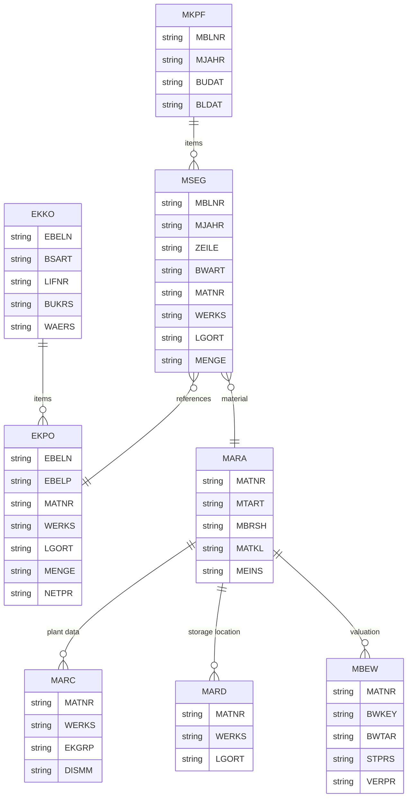

# SAP ECC 6.0 - MM 模块数据库设计

## 概述

SAP MM (Material Management，物料管理) 模块涵盖采购、库存管理和发票校验等功能。

## 子模块

| 子模块 | 代码 | 说明 |
|--------|------|------|
| 物料主数据 | MM01/02/03 | 物料基础数据维护 |
| 采购 | ME21N/22N/23N | 采购订单管理 |
| 库存管理 | MIGO | 货物移动 |
| 发票校验 | MIRO | 供应商发票处理 |
| 评估 | MR21/22 | 物料价格评估 |
| 库存盘点 | MI01/04 | 实物盘点 |

## 核心表清单

### 物料主数据

| 表名 | 说明 |
|------|------|
| MARA | 物料主数据通用数据 |
| MARC | 物料主数据工厂级别 |
| MARD | 物料主数据库存地点 |
| MBEW | 物料评估 |
| MVKE | 物料主数据销售组织 |
| MLAN | 物料主数据税分类 |
| MARM | 物料计量单位 |
| MAKT | 物料描述 |
| MARV | 物料期间控制 |

#### MARA (物料主数据通用数据)

```sql
-- MARA 主要字段
MANDT      MANDT           -- 集团
MATNR      MATNR           -- 物料号
ERSDA      ERSDA           -- 创建日期
ERNAM      ERNAM           -- 创建人
PSTAT      PSTAT_D         -- 维护状态
LVORM      LVORM           -- 删除标识
MTART      MTART           -- 物料类型
MBRSH      MBRSH           -- 行业部门
MATKL      MATKL           -- 物料组
BISMT      BISMT           -- 旧物料号
MEINS      MEINS           -- 基本单位
BSTME      BSTME           -- 订单单位
WRKST      WRKST           -- 基本物料
NORMT      NORMT           -- 行业标准描述
BRGEW      BRGEW           -- 毛重
NTGEW      NTGEW           -- 净重
GEWEI      GEWEI           -- 重量单位
VOLUM      VOLUM           -- 体积
VOLEH      VOLEH           -- 体积单位
BEVOZ_V    BEVOZ_V         -- 净体积百分比
GROES      GROES           -- 大小/尺寸
EAN11      EAN11           -- EAN/UPC 码
NUMTP      NUMTP           -- EAN 类别
WEORA      WEORA           -- 海关信息
TAKLV      TAKLV           -- 危险品标志
EXTWG      EXTWG           -- 外部物料组
SATNR      SATNR           -- 通用物料
ATTYP      ATTYP           -- 类别
KZREV      KZREV           -- 已审核
KZEFF      KZEFF           -- 生效日期
KZKFG      KZKFG           -- 可配置物料
XCHPF      XCHPF           -- 批次管理
VABME      VABME           -- 可变采购单位
KZKUP      KZKUP           -- 联合产品
KZREF      KZREF           -- 数据参考标识
CMETH      CMETH           -- 计数方法
```

#### MARC (物料主数据工厂级别)

```sql
-- MARC 主要字段
MANDT      MANDT           -- 集团
MATNR      MATNR           -- 物料号
WERKS      WERKS_D         -- 工厂
PSTAT      PSTAT_D         -- 维护状态
LVORM      LVORM_MM        -- 删除标识
BWTTY      BWTTY           -- 评估类别
XCHPF      XCHPF           -- 批次管理
MMSTA      MMSTA           -- 工厂特定状态
MMSTD      DATS            -- 工厂状态日期
MAABC      MAABC           -- ABC 标识
KZKFK      KZKFK           -- 关键部件
EKGRP      EKGRP           -- 采购组
AUSME      AUSME           -- 生产存储位置
DISPR      DISPR           -- 工厂特定的物料状态
DISMM      DISMM           -- MRP 类型
DISPO      DISPO           -- MRP 控制员
DISLS      DISLS           -- 批量大小
BSTMI      BSTMI           -- 最小批量
BSTMA      BSTMA           -- 最大批量
BSTFE      BSTFE           -- 固定批量
BSTRF      BSTRF           -- 舍入值
EISBE      EISBE           -- 安全库存
EISLO      EISLO           -- 最小安全库存
PLIFZ      PLIFZ           -- 计划交货时间
WEBAZ      WEBAZ           -- 收货处理时间
PERKZ      PERKZ           -- 期间标识
AUSSS      AUSSS           -- 装配报废百分比
DISGR      DISGR           -- MRP 组
KAUSF      KAUSF           -- 组件报废百分比
RETRO      RETRO           -- 倒推日期
PLNTY      PLNTY           -- 任务清单类型
FRTME      FRTME           -- 运费单位
LFRHY      LFRHY           -- 计划日历
SOBSL      SOBSL           -- 特殊采购类型
AUTRU      AUTRU           -- 预留自动创建
MINLS      MINLS           -- 最小库存水平
MAXLS      MAXLS           -- 最大库存水平
FXPRU      FXPRU           -- 固定价格
MISKZ      MISKZ           -- 混合 MRP
MRPPP      MRPPP           -- 生产计划配置文件
```

### 采购文档

| 表名 | 说明 |
|------|------|
| EKKO | 采购订单头 |
| EKPO | 采购订单项 |
| EKET | 采购订单计划行 |
| EKBE | 采购凭证历史 |
| EKKN | 采购凭证科目分配 |
| EKBZ | 采购凭证费用 |
| EIPA | 采购信息记录 - 条件 |
| EINA | 采购信息记录 - 通用数据 |
| EINE | 采购信息记录 - 采购组织数据 |
| EINA | 采购信息记录通用数据 |

#### EKKO (采购订单头)

```sql
-- EKKO 主要字段
MANDT      MANDT           -- 集团
EBELN      EBELN           -- 采购凭证
BSART      ESART           -- 采购凭证类型
LOEKZ      ELOEK           -- 删除标识
STATU      ESTAT           -- 状态
AEDAT      AEDAT           -- 更改日期
ERNAM      ERNAM           -- 创建人
PINCR      PINCR           -- 最后增量计数
LPONR      LPONR           -- 最后项目号
LIFNR      ELIFN           -- 供应商号
SUPPL      SUPPL           -- 供应商
REL_OBJ    REL_OBJ         -- 采购申请号
SPRAS      SPRAS           -- 语言键
ZTERM      DZTERM          -- 付款条件
ZBD1T      DZBD1T          -- 天数 1
ZBD2T      DZBD2T          -- 天数 2
ZBD3T      DZBD3T          -- 天数 3
ZBD1P      DZBD1P          -- 现金折扣百分比 1
ZBD2P      DZBD2P          -- 现金折扣百分比 2
EKGRP      EKGRP           -- 采购组
WAERS      WAERS           -- 货币
WKURS      WKURS           -- 汇率
KUFIX      KUFIX           -- 固定汇率
KDATV      KDATV           -- 合同有效期起始日
KDATB      KDATB           -- 合同有效期截止日
KDATB      KDATB           -- 合同有效期截止日
KDATV      KDATV           -- 合同有效期起始日
BUKRS      BUKRS           -- 公司代码
GSBER      GSBER           -- 业务范围
KONNR      KONNR           -- 合同
KTWRT      KTWRT           -- 目标价值
KNUMV      KNUMV           -- 条件号
KALSR      KALSR           -- 定价过程
KDATV      KDATV           -- 合同有效期起始日
KDATB      KDATB           -- 合同有效期截止日
AEDAT      AEDAT           -- 更改日期
ANGDT      ANGDT           -- 报价截止日
BNDDT      BNDDT           -- 报价有效期截止日
GWLDT      GWLDT           -- 担保期截止日
IHREZ      IHREZ           -- 您的参考
IHREZ      IHREZ           -- 您的参考
UNSEZ      UNSEZ           -- 我们的参考
VERKF      VERKF           -- 销售人员
TELF1      TELF1           -- 电话
ADRNR      ADRNR           -- 地址号
```

#### EKPO (采购订单项)

```sql
-- EKPO 主要字段
MANDT      MANDT           -- 集团
EBELN      EBELN           -- 采购凭证
EBELP      EBELP           -- 项目编号
LOEKZ      ELOEK           -- 删除标识
STATU      ESTAP           -- 处理状态
AEDAT      AEDAT           -- 更改日期
TXZ01      TXZ01           -- 短文本
MATNR      MATNR           -- 物料号
EMATN      EMATN           -- 需求物料号
BNFPO      BNFPO           -- 项目编号
WERKS      WERKS_D         -- 工厂
LGORT      LGORT_D         -- 库存地点
RESLO      RESLO           -- 发货库存地点
MATKL      MATKL           -- 物料组
INFNR      INFNR           -- 采购信息记录
EKGRP      EKGRP           -- 采购组
BEDNR      BEDNR           -- 需求跟踪号
EFFWR      EFFWR           -- 有效价值
MEINS      BSTME           -- 采购订单单位
BSTME      BSTME           -- 订单价格单位
BPUMN      BPUMN           -- 分子
BPUMZ      BPUMZ           -- 分母
UMREN      UMREN           -- 分子
UMREZ      UMREZ           -- 分母
PEINH      PEINH           -- 价格单位
NETPR      BPREI           -- 净价
BPRME      BPRME           -- 订单价格单位
NETWR      BWERT           -- 净订单值
WAERS      WAERS           -- 货币
MWSKZ      MWSKZ           -- 税码
MWSKZ      MWSKZ           -- 税码
BWTAR      BWTAR           -- 评估类型
MATDOC     MATDOC          -- 物料凭证号
WERKS      WERKS_D         -- 工厂
ELIKZ      ELIKZ           -- "已交货"标识
EREKZ      EREKZ           -- "最终发票"标识
WEPOS      WEPOS           -- 收货标识
WEMPF      WEMPF           -- 收货方
WEUNB      WEUNB           -- 未评估收货
REPOS      REPOS           -- 发票收据标识
WEBRE      WEBRE           -- 基于收货的发票验证
KZVBR      KZVBR           -- 消耗过账
VABSKZ     VABSKZ          -- 非发票项标识
NTGEW      NTGEW_15        -- 净重
GEWEI      GEWEI           -- 重量单位
```

### 库存管理

| 表名 | 说明 |
|------|------|
| MARD | 物料主数据库存地点 |
| MCHB | 批次库存 |
| MCH1 | 批次主记录 |
| MSKU | 特殊库存客户 |
| MSPR | 特殊库存预订 |
| MSLB | 特殊库存供应商 |
| MSKU | 特殊库存客户 |
| MARA | 物料主记录 |
| MARC | 物料主记录工厂 |
| MKOL | 寄存库存 |
| T001L | 库存地点 |
| T001W | 工厂 |

#### 库存移动表

| 表名 | 说明 |
|------|------|
| MKPF | 物料凭证头 |
| MSEG | 物料凭证段 |
| IMSEG | 库存管理段 (临时) |
| VM07M | 物料凭证视图 |

#### MKPF (物料凭证头)

```sql
-- MKPF 主要字段
MANDT      MANDT           -- 集团
MBLNR      MBLNR           -- 物料凭证号
MJAHR      MJAHR           -- 物料年度
USNAM      USNAM           -- 用户名
CPUDT      CPUDT           -- 会计输入日期
CPUTM      CPUTM           -- 会计输入时间
AEDAT      AEDAT           -- 更改日期
TCODE      TCODE           -- 事务代码
BLART      BLART           -- 凭证类型
BKTXT      BKTXT           -- 凭证头文本
BUDAT      BUDAT           -- 过账日期
BLDAT      BLDAT           -- 凭证日期
XBLNR      XBLNR1          -- 参考凭证号
FRATH      FRATH           -- 转换因子
FRBNR      FRBNR           -- 物料凭证
WEACT      WEACT           -- 工作流标识
```

#### MSEG (物料凭证段)

```sql
-- MSEG 主要字段
MANDT      MANDT           -- 集团
MBLNR      MBLNR           -- 物料凭证号
MJAHR      MJAHR           -- 物料年度
ZEILE      MBLPO           -- 物料凭证项目
BWART      BWART           -- 移动类型
SOBKZ      SOBKZ           -- 特殊库存标识
KZVBR      KZVBR           -- 消耗过账
KZBEW      KZBEW           -- 移动指示符
KZZUG      KZZUG           -- 入库标识
KZWRT      KZWRT           -- 值更新
KZEAUS     KZEAUS          -- 计划产生
LTEXT      LTEXT           -- 字符文本
MATNR      MATNR           -- 物料号
WERKS      WERKS_D         -- 工厂
LGORT      LGORT_D         -- 库存地点
CHARG      CHARG_D         -- 批次号
LGORT      LGORT_D         -- 库存地点
LIFNR      LIFNR           -- 供应商号
KUNNR      KUNNR           -- 客户号
SHKZG      SHKZG           -- 借/贷标识
WAERS      WAERS           -- 货币
DMBTR      DMBTR           -- 本位币金额
ERFME      ERFME           -- 以输入单位表示的数量
ERFMG      ERFMG           -- 以输入单位表示的数量
ERFMG2     ERFMG2          -- 数量 2
BPMNG      BPMNG           -- 以订单价格单位表示的数量
MENGE      MENGE_D         -- 数量
MEINS      MEINS           -- 基本单位
BUDAT      BUDAT           -- 过账日期
BWDAT      BWDAT           -- 评估日期
BPLP2      BPLP2           -- 审批方 2
```

### 物料评估

| 表名 | 说明 |
|------|------|
| MBEW | 物料评估 |
| MBEWH | 物料评估历史 |
| EBEW | 采购订单评估 |
| EBEWH | 采购订单评估历史 |
| QBEW | 外协加工物料评估 |
| OBEW | 订单库存评估 |

#### MBEW (物料评估)

```sql
-- MBEW 主要字段
MANDT      MANDT           -- 集团
MATNR      MATNR           -- 物料号
BWKEY      BWKEY           -- 评估范围
BWTAR      BWTAR           -- 评估类型
LVORM      LVORM_WM        -- 删除标识
VERPR      VERPR           -- 移动平均价
STPRS      STPRS           -- 标准价格
PEINH      PEINH           -- 价格单位
BKLAS      BKLAS           -- 评估类
SAKTO      SAKTO           -- 会计科目
VPRSV      VPRSV           -- 价格控制
HKONT      HKONT           -- 总账科目
EKALR      EKALR           -- 评估级别
ZPLPR      ZPLPR           -- 计划价格
ZPLP1      ZPLP1           -- 计划价格 1
ZPLP2      ZPLP2           -- 计划价格 2
ZPLP3      ZPLP3           -- 计划价格 3
ZPLD1      ZPLD1           -- 计划价格日期 1
ZPLD2      ZPLD2           -- 计划价格日期 2
ZPLD3      ZPLD3           -- 计划价格日期 3
PPERZ      PPERZ           -- 期间
PPERL      PPERL           -- 期间
PPERV      PPERV           -- 期间
BWPH1      BWPH1           -- 未来价格 1
BWPH2      BWPH2           -- 未来价格 2
BWPH3      BWPH3           -- 未来价格 3
```

### 条件表

| 表名 | 说明 |
|------|------|
| KONV | 条件项 (聚簇) |
| A001 | 条件表 001 |
| A002 | 条件表 002 |
| A004 | 条件表 004 |
| A005 | 条件表 005 |
| A017 | 条件表 017 |
| A018 | 条件表 018 |
| A019 | 条件表 019 |
| KONP | 条件 (项目) |
| KONH | 条件 (头) |
| KONM | 条件等级 |
| KONW | 条件值 |

## 表关系图



## 查询示例

### 获取物料主数据

```sql
-- 物料通用数据
SELECT MATNR, MTART, MBRSH, MATKL, MEINS
FROM MARA
WHERE MATNR = '000000000001001234';

-- 物料工厂数据
SELECT MATNR, WERKS, EKGRP, DISMM, DISPO
FROM MARC
WHERE MATNR = '000000000001001234'
  AND WERKS = '1000';

-- 物料评估数据
SELECT MATNR, BWKEY, STPRS, VERPR, VPRSV, BKLAS
FROM MBEW
WHERE MATNR = '000000000001001234'
  AND BWKEY = '1000';
```

### 获取采购订单

```sql
-- 采购订单头
SELECT EBELN, BSART, LIFNR, BUKRS, WAERS, AEDAT
FROM EKKO
WHERE EBELN = '4500000001';

-- 采购订单项
SELECT EBELP, MATNR, TXZ01, WERKS, LGORT,
       MENGE, MEINS, NETPR, NETWR
FROM EKPO
WHERE EBELN = '4500000001';
```

### 获取库存

```sql
-- 库存地点库存
SELECT MATNR, WERKS, LGORT, LABST, INSME, SPEME
FROM MARD
WHERE MATNR = '000000000001001234'
  AND WERKS = '1000';

-- 批次库存
SELECT MATNR, WERKS, LGORT, CHARG, CLABS
FROM MCHB
WHERE MATNR = '000000000001001234'
  AND WERKS = '1000';
```

### 获取货物移动

```sql
-- 物料凭证头
SELECT MBLNR, MJAHR, BUDAT, BLDAT, BKTXT
FROM MKPF
WHERE MBLNR = '4900000001';

-- 物料凭证项
SELECT ZEILE, BWART, MATNR, WERKS, LGORT,
       MENGE, MEINS, DMBTR, WAERS
FROM MSEG
WHERE MBLNR = '4900000001'
  AND MJAHR = '2024';
```

## 参考资源

- SAP MM 表参考: https://www.leanx.eu/en/sap-tables/mm
- SAP Help - Materials Management: https://help.sap.com/docs/SAP_S4HANA_ON-PREMISE
