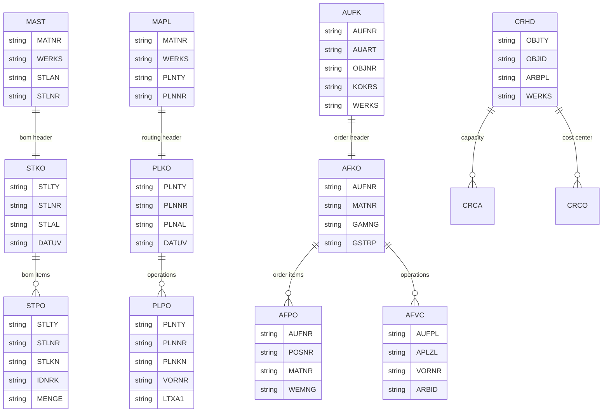

# SAP ECC 6.0 - PP 模块数据库设计

## 概述

SAP PP (Production Planning，生产计划) 模块涵盖物料需求计划 (MRP)、生产订单、BOM 和工艺路线管理。

## 子模块

| 子模块 | 代码 | 说明 |
|--------|------|------|
| 物料需求计划 | MD01/02/03 | MRP 运行 |
| BOM 管理 | CS01/02/03 | 物料清单 |
| 工艺路线 | CA01/02/03 | 工序计划 |
| 生产订单 | CO01/02/03 | 生产订单处理 |
| 产能计划 | CM01/07 | 产能评估 |
| 车间控制 | CO14/15/19 | 确认与报表 |

## 核心表清单

### BOM 管理

| 表名 | 说明 |
|------|------|
| MAST | 物料 BOM |
| STKO | BOM 头 |
| STPO | BOM 项目 |
| STAS | BOM - 项目选择 |
| STPU | BOM - 子项目 |
| STZU | 临时 BOM |
| STT | BOM 用途文本 |
| T416 | BOM 用途 |

#### STKO (BOM 头)

```sql
-- STKO 主要字段
MANDT      MANDT           -- 集团
STLTY      STLTY           -- BOM 类别
STLNR      STLNR           -- 物料清单
STLAL      STLAL           -- 可选的 BOM
STLST      STLST           -- BOM 状态
DATUV      DATUV           -- 有效起始日
DATUB      DATUB           -- 有效截止日
TECHV      TECHV           -- 技术状态
TECHV_DATE TECHV_DATE      -- 技术状态日期
CADKN      CADKN           -- CAD 标识
STLFX      STLFX           -- 固定标识
STLKZ      STLKZ           -- BOM 指示符
STLTX      STLTX           -- BOM 文本
AENNR      AENNR           -- 更改号
AEDAT      AEDAT           -- 更改日期
AENAM      AENAM           -- 更改人
ANDAT      ANDAT           -- 创建日期
ANNAM      ANNAM           -- 创建人
BMEIN      BMEIN           -- 基本计量单位
BMENG      BMENG           -- 基本数量
BSTMA      BSTMA           -- 最大批量大小
BSTMI      BSTMI           -- 最小批量大小
STUCH      STUCH           -- 文档
DOKAR      DOKAR           -- 文档类型
DOKNR      DOKNR           -- 文档号
DOKTL      DOKTL           -- 文档部分
DOKVR      DOKVR           -- 文档版本
EKGRP      EKGRP           -- 采购组
LAGRU      LAGRU           -- 生产存储位置
LGFSB      LGFSB           -- 外协库存地点
PLNNR      PLNNR           -- 任务清单组码
PLNAL      PLNAL           -- 组计数器
STLUE      STLUE           -- 分配
STLKR      STLKR           -- BOM 类别
KNRMT      KNRMT           -- 组件
KNRFB      KNRFB           -- 反冲
KNRMM      KNRMM           -- 制造
KNRFE      KNRFE           -- 外协加工
KNRSM      KNRSM           -- 装配报废
KNRSA      KNRSA           -- 组件报废
KNRPS      KNRPS           -- 生产供应区域
KNRPZ      KNRPZ           -- 生产仓储地
KNRVS      KNRVS           -- 作业类型
```

#### STPO (BOM 项目)

```sql
-- STPO 主要字段
MANDT      MANDT           -- 集团
STLTY      STLTY           -- BOM 类别
STLNR      STLNR           -- 物料清单
STLKN      STLKN           -- BOM 项目节点号
STPOZ      STPOZ           -- 内部计数器
DATUV      DATUV           -- 有效起始日
DATUB      DATUB           -- 有效截止日
AENNR      AENNR           -- 更改号
POSNR      POSNR           -- 项目编号
POSTP      POSTP           -- 项目类别 (物料/文本/文档)
IDNRK      IDNRK           -- 组件
MENGE      MENGE           -- 组件数量
MEINS      MEINS           -- 组件单位
SORTF      SORTF           -- 排序字符串
SORTL      SORTL           -- 排序字符串
FMENG      FMENG           -- 固定数量
AUSCH      AUSCH           -- 组件报废
UPSKZ      UPSKZ           -- 子项目标识
SANKA      SANKA           -- 成本核算相关
SANFE      SANFE           -- 与生产相关
SANIN      SANIN           -- 与工厂维护相关
SANKO      SANKO           -- 与工程/设计相关
SANVS      SANVS           -- 销售订单相关
SANLK      SANLK           -- 配置
DROFL      DROFL           -- 删除标识
ALPGR      ALPGR           -- 替代项: 组
ALPRF      ALPRF           -- 替代项: 排名
ALPST      ALPST           -- 替代项: 策略
EWAHR      EWAHR           -- 使用概率
KXTAG      KXTAG           -- 工程设计变更日期
NLFZT      NLFZT           -- 提前期
LHNDT      LHNDT           -- 前导时间偏置
VWPOS      VWPOS           -- 上级物料
LIFZT      LIFZT           -- 交货时间
LIFNR      LIFNR           -- 供应商
ROMS1      ROMS1           -- 舍入值
ROMS2      ROMS2           -- 舍入值 2
ROMS3      ROMS3           -- 舍入值 3
REKRI      REKRI           -- 来源
REKRV      REKRV           -- 结果
RGEKZ      RGEKZ           -- 反冲
VERTI      VERTI           -- 分配
BEIKZ      BEIKZ           -- 物料组件
BESKZ      BESKZ           -- 采购类型
SOBSL      SOBSL           -- 特殊采购类型
LGPRO      LGPRO           -- 生产仓储地
WEITG      WEITG           -- 等待时间
KMPRZ      KMPRZ           -- 组件百分比
MATKL      MATKL           -- 物料组
POTX1      POTX1           -- BOM 项目文本 1
POTX2      POTX2           -- BOM 项目文本 2
AEDAT      AEDAT           -- 更改日期
AENAM      AENAM           -- 更改人
ANDAT      ANDAT           -- 创建日期
ANNAM      ANNAM           -- 创建人
```

### 工艺路线

| 表名 | 说明 |
|------|------|
| MAPL | 物料任务清单分配 |
| PLKO | 任务清单头 |
| PLPO | 任务清单工序 |
| PLAS | 任务清单 - 工序选择 |
| PLFH | 任务清单 - 生产资源/工具分配 |
| PLMZ | 任务清单 - 物料组件分配 |
| PLAB | 任务清单 - 检验特性分配 |
| PLPH | 生产资源/工具 |
| PLWP | 工作中心 |

#### PLKO (任务清单头)

```sql
-- PLKO 主要字段
MANDT      MANDT           -- 集团
PLNTY      PLNTY           -- 任务清单类型
PLNNR      PLNNR           -- 任务清单组码
PLNAL      PLNAL           -- 组计数器
DATUV      DATUV           -- 有效起始日
DATUB      DATUB           -- 有效截止日
AENNR      AENNR           -- 更改号
PLNME      PLNME           -- 任务清单计量单位
LOEKZ      LOEKZ           -- 删除标识
PLNST      PLNST           -- 状态
VERWE      VERWE           -- 任务清单用途
WERKS      WERKS_D         -- 工厂
STATU      STATU           -- 状态
KTEXT      KTEXT_PP        -- 描述
WERK       WERK            -- 工作
GRUPP      GRUPP           -- 组
KAPAR      KAPAR           -- 产能类别
LOART      LOART           -- 生产类型
BMEFL      BMEFL           -- 基本数量
BMSCH      BMSCH_PP        -- 基本数量
VORGW      VORGW           -- 工厂
SBDKZ      SBDKZ           -- 批量大小
STGDT      STGDT           -- 冻结日期
STTAG      STTAG           -- 生效日期
SUMNG      SUMNG           -- 总数量
SUMME      SUMME_PP        -- 总数量
TAKZT      TAKZT           -- 节拍时间
SPRZT      SPRZT           -- 分割
KSTRG      KSTRG           -- 成本核算表
TARG       TARG            -- 目标
KST        KST             -- 成本中心
LTXA1      LTXA1           -- 标准文本
TEILS      TEILS           -- 部分标识
```

#### PLPO (任务清单工序)

```sql
-- PLPO 主要字段
MANDT      MANDT           -- 集团
PLNTY      PLNTY           -- 任务清单类型
PLNNR      PLNNR           -- 任务清单组码
PLNKN      PLNKN           -- 任务清单节点号
PLNAL      PLNAL           -- 组计数器
DATUV      DATUV           -- 有效起始日
DATUB      DATUB           -- 有效截止日
AENNR      AENNR           -- 更改号
VORNR      VORNR           -- 工序
VORNV      VORNV           -- 工序
PLNFL      PLNFL           -- 顺序
STEUS      STEUS           -- 控制码
ARBID      ARBID           -- 对象标识
KTSCH      KTSCH           -- 标准文本码
LTXA1      LTXA1           -- 标准文本
WERKS      WERKS_D         -- 工厂
BMSCH      BMSCH_PP        -- 基本数量
MEINH      MEINH_PP        -- 计量单位
VGW01      VGW01           -- 标准值 1
VGW02      VGW02           -- 标准值 2
VGW03      VGW03           -- 标准值 3
VGW04      VGW04           -- 标准值 4
VGW05      VGW05           -- 标准值 5
VGW06      VGW06           -- 标准值 6
VGE01      VGE01           -- 标准值计量单位 1
VGE02      VGE02           -- 标准值计量单位 2
VGE03      VGE03           -- 标准值计量单位 3
VGE04      VGE04           -- 标准值计量单位 4
VGE05      VGE05           -- 标准值计量单位 5
VGE06      VGE06           -- 标准值计量单位 6
BMSCH      BMSCH_PP        -- 基本数量
SPMUS      SPMUS           -- 雇员数
SPLIM      SPLIM           -- 分割
SPLAR      SPLAR           -- 分割类型
SPLBE      SPLBE           -- 分配
ZEINR      ZEINR           -- 文档号
ZEIV        ZEIV           -- 文档版本
ZEiar      ZEiar           -- 文档类型
ZEITL      ZEITL           -- 文档部分
MSEHI      MSEHI           -- 计量单位
NORMT      NORMT           -- 行业标准
LOEKZ      LOEKZ           -- 删除标识
FLIES      FLIES           -- 流水线
UEKKN      UEKKN           -- 返工工序
SORTF      SORTF           -- 排序字符串
TSKNO      TSKNO           -- 任务号
TUEK        TUEK           -- 返工
```

### 生产订单

| 表名 | 说明 |
|------|------|
| AUFK | 订单主记录 |
| AFKO | 订单头数据 PP 订单 |
| AFPO | 订单项 |
| AFVC | 订单工序 |
| AFVU | 订单工序: 附加数据 |
| AFFL | 订单工序 |
| AFRU | 订单确认 |
| AFRH | 确认头记录 |
| AFRU | 确认 |

#### AUFK (订单主记录)

```sql
-- AUFK 主要字段
MANDT      MANDT           -- 集团
AUFNR      AUFNR           -- 订单号
AUART      AUART           -- 订单类型
AUTYP      AUTYP           -- 订单类别
ERDAT      ERDAT_AUFK      -- 创建日期
ERNAM      ERNAM_AUFK      -- 创建人
AENAM      AENAM           -- 更改人
AEDAT      AEDAT           -- 更改日期
KTEXT      KTEXT_AUFK      -- 描述
LOEKZ      LOEKZ_AUFK      -- 删除标识
STAT       STAT_AUFK       -- 状态
OBJNR      OBJNR           -- 对象号
KOKRS      KOKRS           -- 控制范围
BUKRS      BUKRS           -- 公司代码
WERKS      WERKS_D         -- 工厂
KOSTV      KOSTV           -- 负责成本中心
KOSTL      KOSTL           -- 成本中心
GSBER      GSBER           -- 业务范围
PROFL      PROFL_AUFK      -- 利润中心
PRCTR      PRCTR           -- 利润中心
ABKRS      ABKRS           -- 薪酬范围
WAERS      WAERS_AUFK      -- 货币
PHAS0      PHAS0           -- 阶段 0
PHAS1      PHAS1           -- 阶段 1
PHAS2      PHAS2           -- 阶段 2
PHAS3      PHAS3           -- 阶段 3
PHAS4      PHAS4           -- 阶段 4
PHAS5      PHAS5           -- 阶段 5
PHAS6      PHAS6           -- 阶段 6
```

#### AFKO (订单头数据 PP 订单)

```sql
-- AFKO 主要字段
MANDT      MANDT           -- 集团
AUFNR      AUFNR           -- 订单号
AUTYP      AUTYP           -- 订单类别
WERKS      WERKS_D         -- 工厂
PLGRO      PLGRO           -- 生产计划员
PLGRP      PLGRP           -- MRP 控制员
FEVOR      FEVOR           -- 生产调度员
DISPO      DISPO           -- MRP 控制员
PRIOR      PRIOR           -- 优先级
STLTY      STLTY           -- BOM 类别
STLBEZ     STLBEZ          -- BOM
STLNR      STLNR           -- BOM 号
STLAL      STLAL           -- 可选 BOM
STTXT      STTXT_PP        -- 状态
PLNFL      PLNFL_AFPO      -- 顺序
PLNBEZ     PLNBEZ          -- 任务清单
PLNNR      PLNNR           -- 任务清单组码
PLNAL      PLNAL_AFPO      -- 组计数器
PLNTY      PLNTY           -- 任务清单类型
PLNAW      PLNAW           -- 任务清单用途
TERKZ      TERKZ           -- 交货标识
STLUE      STLUE           -- 分配
PWERK      PWERK           -- 生产工厂
PWWRK      PWWRK           -- 计划工厂
LGPRO      LGPRO           -- 生产库存地点
LGPRO      LGPRO           -- 生产库存地点
MATNR      MATNR           -- 物料号
GAMNG      GAMNG           -- 总订单数量
GMEIN      GMEIN           -- 基本计量单位
PLNME      PLNME           -- 任务清单计量单位
GLTRI      GLTRI           -- 实际完成日期
GSTRP      GSTRP           -- 基本开始日期
GLTRP      GLTRP           -- 基本完成日期
GSTRI      GSTRI           -- 实际开始日期
FTRMI      FTRMI           -- 实际下达日期
ERDAT      ERDAT           -- 创建日期
ERNAM      ERNAM           -- 创建人
AEDAT      AEDAT           -- 更改日期
AENAM      AENAM           -- 更改人
CUOBJ      CUOBJ           -- 配置
CUOBJ_AFTER CUOBJ_AFTER    -- 配置 (批次)
```

#### AFPO (订单项)

```sql
-- AFPO 主要字段
MANDT      MANDT           -- 集团
AUFNR      AUFNR           -- 订单号
POSNR      POSNR_AFPO      -- 订单项目
PROJN      PROJN           -- 项目定义
PSPEL      PSPEL           -- WBS 元素
KDAUF      KDAUF           -- 销售订单
KDPOS      KDPOS           -- 销售订单项目
KDEIN      KDEIN           -- 销售订单项目计划类别
MATNR      MATNR           -- 物料号
MAKTX      MAKTX           -- 物料描述
PWERK      PWERK_AFPO      -- 生产工厂
LGORT      LGORT_D         -- 库存地点
MEINS      MEINS           -- 基本计量单位
BMEIN      BMEIN           -- 订单单位
WEMNG      WEMNG           -- 收货数量
WAMNG      WAMNG           -- 废品数量
AMNGV      AMNGV           -- 交付数量
GMNGA      GMNGA           -- 已确认产量
BMNG2      BMNG2           -- 已确认产量
QMNGV      QMNGV           -- 检验数量
GMNGA      GMNGA           -- 已确认产量
ERDAT      ERDAT_AFPO      -- 创建日期
ERNAM      ERNAM_AFPO      -- 创建人
AEDAT      AEDAT_AFPO      -- 更改日期
AENAM      AENAM_AFPO      -- 更改人
```

### 工作中心

| 表名 | 说明 |
|------|------|
| CRHD | 工作中心头 |
| CRTX | 工作中心文本 |
| CRCA | 工作中心产能分配 |
| CRCO | 工作中心成本中心分配 |
| CRCR | 产能 |
| CRCP | 产能段 |
| CRHD_OLD | 工作中心历史 |
| CRCC | 工作中心成本中心 |

#### CRHD (工作中心头)

```sql
-- CRHD 主要字段
MANDT      MANDT           -- 集团
OBJTY      OBJTY           -- 对象类型
OBJID      OBJID           -- 对象标识
ARBPL      ARBPL           -- 工作中心
WERKS      WERKS_D         -- 工厂
VERWE      VERWE_CRHD      -- 工作中心类别
STEUS      STEUS_CRHD      -- 控制码
LVCOD      LVCOD           -- 层次结构区域
KAPID      KAPID           -- 产能
LOEKZ      LOEKZ_CRHD      -- 删除标识
LVORM      LVORM_CRHD      -- 删除标识
SPRAS      SPRAS           -- 语言
KTEXT      KTEXT_CRHD      -- 文本
PLANTY     PLANTY          -- 任务清单类型
PLANGR     PLANGR          -- 计划组
VERAN      VERAN           -- 责任人
WAUSW      WAUSW           -- 废品
ANLWERT    ANLWERT         -- 使用值
STAND      STAND           -- 标准
STAND2     STAND2          -- 标准 2
PHASU      PHASU           -- 阶段
FORT3      FORT3           -- 报表
LOC01      LOC01           -- 位置
ADDRESS    AD_ADDRNUM      -- 地址号
```

### MRP 相关表

| 表名 | 说明 |
|------|------|
| MDKP | MRP 凭证头 |
| MDTB | MRP 表 |
| MDVM | 库存/需求清单 |
| MDVL | 长期计划库存/需求清单 |
| RESB | 预留/相关需求 |
| MATDOC | 物料凭证 |

#### RESB (预留/相关需求)

```sql
-- RESB 主要字段
MANDT      MANDT           -- 集团
RSNUM      RSNUM           -- 预留/相关需求的编号
RSPOS      RSPOS           -- 预留/相关需求中的项目编号
RSART      RSART           -- 记录类型
KZEAR      KZEAR           -- 最后出库标识
XLOEK      XLOEK_RESB      -- 删除标识
MATNR      MATNR           -- 物料号
WERKS      WERKS_D         -- 工厂
LGORT      LGORT_D         -- 库存地点
UMLGO      UMLGO           -- 转储库存地点
CHARG      CHARG_D         -- 批次号
BDART      BDART           -- 需求类型
XWAOK      XWAOK           -- 指示符: 移动
XBEAR      XBEAR           -- 指示符: 处理
XDELE      XDELE           -- 指示符: 删除
BDTER      BDTER           -- 需求日期
BDMNG      BDMNG           -- 需求量
ENMNG      ENMNG           -- 提货数量
MEINS      MEINS           -- 基本计量单位
BMEINS     BMEINS_RESB     -- 订单单位
ERFME      ERFME_RESB      -- 输入单位
ERFMG      ERFMG_RESB      -- 以输入单位计的数量
AUSCH      AUSCH_RESB      -- 组件报废百分比
UMWRK      UMWRK           -- 收货工厂
ERDAT      ERDAT_RESB      -- 创建日期
ERNAM      ERNAM_RESB      -- 创建人
AEDAT      AEDAT_RESB      -- 更改日期
AENAM      AENAM_RESB      -- 更改人
```

## 表关系图



## 查询示例

### 获取 BOM 信息

```sql
-- 获取物料 BOM 分配
SELECT MATNR, WERKS, STLAN, STLNR, STLAL
FROM MAST
WHERE MATNR = '000000000001001234'
  AND WERKS = '1000';

-- 获取 BOM 头信息
SELECT STLTY, STLNR, STLAL, DATUV, BMENG, BMEIN
FROM STKO
WHERE STLNR = '00000001';

-- 获取 BOM 项目
SELECT STLKN, IDNRK, MENGE, MEINS, POSTP, SORTF
FROM STPO
WHERE STLTY = 'M'
  AND STLNR = '00000001';
```

### 获取工艺路线

```sql
-- 获取物料工艺路线分配
SELECT MATNR, WERKS, PLNTY, PLNNR, PLNAL
FROM MAPL
WHERE MATNR = '000000000001001234'
  AND WERKS = '1000';

-- 获取工艺路线头
SELECT PLNTY, PLNNR, PLNAL, DATUV, KTEXT, VERWE
FROM PLKO
WHERE PLNNR = '00000001';

-- 获取工艺路线工序
SELECT VORNR, LTXA1, ARBID, BMSCH, VGW01, VGE01
FROM PLPO
WHERE PLNTY = 'N'
  AND PLNNR = '00000001';
```

### 获取生产订单

```sql
-- 获取订单主记录
SELECT AUFNR, AUART, WERKS, KOKRS, OBJNR, KTEXT
FROM AUFK
WHERE AUFNR = '1000000001';

-- 获取订单头数据
SELECT AUFNR, MATNR, GAMNG, GMEIN, GSTRP, GLTRP, STLNR, PLNNR
FROM AFKO
WHERE AUFNR = '1000000001';

-- 获取订单项
SELECT POSNR, MATNR, MAKTX, WEMNG, MEINS, LGORT
FROM AFPO
WHERE AUFNR = '1000000001';
```

### 获取工作中心

```sql
-- 获取工作中心
SELECT OBJID, ARBPL, WERKS, VERWE, KTEXT
FROM CRHD
WHERE ARBPL = 'LINE01'
  AND WERKS = '1000';

-- 获取工作中心产能
SELECT OBJID, KAPID, KAPAR, VERWE
FROM CRCA
WHERE OBJID = '00000001';
```

## 参考资源

- SAP PP 表参考: https://www.leanx.eu/en/sap-tables/pp
- SAP Help - Production Planning: https://help.sap.com/docs/SAP_S4HANA_ON-PREMISE
