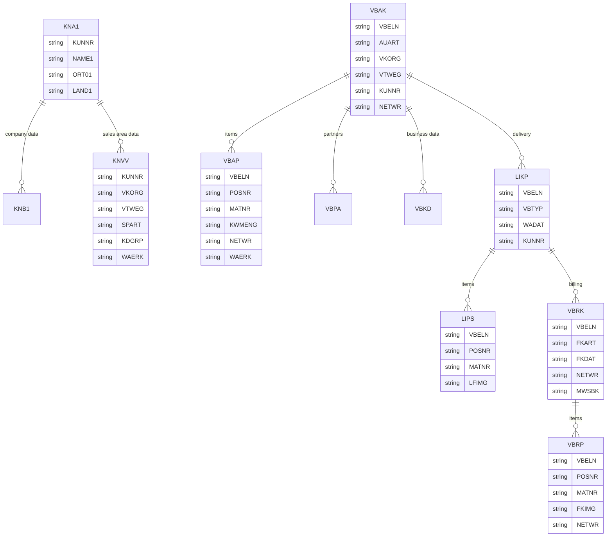

# SAP ECC 6.0 - SD 模块数据库设计

## 概述

SAP SD (Sales and Distribution，销售分销) 模块涵盖销售、发货和开票等业务流程。

## 子模块

| 子模块 | 代码 | 说明 |
|--------|------|------|
| 销售支持 | VS00 | 销售信息系统 |
| 主数据 | VD01/02/03 | 客户主数据 |
| 销售订单 | VA01/02/03 | 销售订单处理 |
| 可用性检查 | CO09 | ATP 检查 |
| 发货 | VL01N/02N | 外向交货 |
| 拣配 | LT03 | 拣配单 |
| 运输 | VT01N | 运输单 |
| 开票 | VF01/02 | 开票凭证 |

## 核心表清单

### 客户主数据

| 表名 | 说明 |
|------|------|
| KNA1 | 客户主数据通用部分 |
| KNB1 | 客户主数据公司代码部分 |
| KNB5 | 客户催款数据 |
| KNBK | 客户银行数据 |
| KNEX | 客户出口数据 |
| KNKK | 客户信贷管理 |
| KNVP | 客户合作伙伴 |
| KNVI | 客户税务信息 |
| KNKA | 客户头数据 |
| KNVD | 客户销售数据 |
| KNVV | 客户销售范围数据 |
| KNMT | 客户物料信息记录 |

#### KNA1 (客户主数据通用部分)

```sql
-- KNA1 主要字段
MANDT      MANDT           -- 集团
KUNNR      KUNNR           -- 客户号
LAND1      LAND1_GP        -- 国家
NAME1      NAME1_GP        -- 名称 1
NAME2      NAME2_GP        -- 名称 2
ORT01      ORT01_GP        -- 城市
ORT02      ORT02_GP        -- 区
PFACH      PFACH_GP        -- 邮政信箱
PSTLZ      PSTLZ_GP        -- 邮政编码
REGIO      REGIO           -- 地区
SORTL      SORTL_GP        -- 排序字段
STRAS      STRAS_GP        -- 街道
TELBX      TELBX_GP        -- 电传信箱
TELF1      TELF1_GP        -- 电话 1
TELF2      TELF2_GP        -- 电话 2
TELTX      TELTX_GP        -- 电文
TELX1      TELX1_GP        -- 电传号
LIFNR      LIFNR           -- 供应商号
SPRAS      SPRAS           -- 语言
FISKN      FISKN           -- 总部
BRSCH      BRSCH           -- 行业代码
KUKLA      KUKLA           -- 客户分类
JMZAH      JMZAH           -- 法律形式
JMJAH      JMJAH           -- 成立年份
JMENA      JMENA           -- 年营业额
KATR1      KATR1           -- 属性 1
KATR2      KATR2           -- 属性 2
KATR3      KATR3           -- 属性 3
KATR4      KATR4           -- 属性 4
UMSA1      UMSA1           -- 年销售
UMSA2      UMSA2           -- 年销售 2
UMJAH      UMJAH           -- 销售年度
HZUOR      HZUOR           -- 层级分配
ERDAT      ERDAT           -- 创建日期
ERNAM      ERNAM           -- 创建人
SPERR      SPERR_GP        -- 订单冻结
AUFSD      AUFSD_GP        -- 订单冻结
CASSD      CASSD           -- 完全冻结
LIFSD      LIFSD_GP        -- 交货冻结
FAKSD      FAKSD_GP        -- 开票冻结
LOEVM      LOEVM_GP        -- 删除标识
ADRNR      ADRNR           -- 地址号
MCOD1      MCOD1_GP        -- 搜索项 1
MCOD2      MCOD2_GP        -- 搜索项 2
MCOD3      MCOD3_GP        -- 搜索项 3
ANRED      ANRED_GP        -- 称谓
BAHNS      BAHNS_GP        -- 火车站
BBBNR      BBBNR           -- 国际地点号 1
BBSNR      BBSNR           -- 国际地点号 2
BUBKZ      BUBKZ           -- 校验号
DATLT      DATLT_GP        -- 数据通信号
DTAMS      DTAMS_GP        -- 数据传输状态
ERLNR      ERLNR           -- 失败原因代码
EXTNR      EXTNR           -- 外部号
GBORT      GBORT_GP        -- 出生地点
GBDAT      GBDAT           -- 出生日期
KNAZK      KNAZK           -- 会计分类
KNRZA      KNRZA           -- 总部
KONZS      KONZS_GP        -- 集团代码
KUKLA      KUKLA           -- 客户分类
KURSV      KURSV           -- 货币类型
LAND2      LAND2           -- 原产地
LORNR      LORNR           -- 外贸数据
NAME3      NAME3_GP        -- 名称 3
NAME4      NAME4_GP        -- 名称 4
NIELS      NIELS           -- NIELS 代码
ORTGP      ORTGP_GP        -- 车站
PFORT      PFORT_GP        -- 邮政信箱城市
STCD1      STCD1           -- 税号 1
STCD2      STCD2           -- 税号 2
STKZA      STKZA           -- 特殊税标识
STKZU      STKZU           -- 特殊税标识
TELF1      TELF1_GP        -- 电话 1
TELFX      TELFX_GP        -- 传真号
TITLV      TITLV_GP        -- 学术称谓
TYPEL      TYPEL_GP        -- 电信服务类型
XCPDE      XCPDE           -- CPD 客户
XZEMP      XZEMP           -- 付款方不同
```

#### KNVV (客户销售范围数据)

```sql
-- KNVV 主要字段
MANDT      MANDT           -- 集团
KUNNR      KUNNR           -- 客户号
VKORG      VKORG           -- 销售组织
VTWEG      VTWEG           -- 分销渠道
SPART      SPART           -- 产品组
LOEVM      LOEVM_VK        -- 删除标识
AUFSD      AUFSD_VK        -- 订单冻结
KALKS      KALKS           -- 客户定价过程
KDGRP      KDGRP           -- 客户组
KONDA      KONDA           -- 价格组
PLTYP      PLTYP           -- 价格清单
BZIRK      BZIRK           -- 销售区域
BZTXT      BZTXT           -- 销售区域文本
KOND1      KOND1           -- 附加价格组 1
KOND2      KOND2           -- 附加价格组 2
KOND3      KOND3           -- 附加价格组 3
KOND4      KOND4           -- 附加价格组 4
KOND5      KOND5           -- 附加价格组 5
WAERK      WAERK           -- 销售货币
HITYP_PR   HITYP_PR        -- 价格清单类型
PRREK      PRREK           -- 价格清单
PRFRQ      PRFRQ           -- 定价更新频率
TAXKD      TAXKD           -- 客户税分类
KZAZU      KZAZU           -- 订单合并
VSBED      VSBED           -- 装运条件
VWERK      VWERK           -- 装运工厂
LIFSD      LIFSD_VK        -- 交货冻结
FAKSD      FAKSD_VK        -- 开票冻结
INCO1      INCO1_V1        -- 国际贸易条款 1
INCO2      INCO2_V1        -- 国际贸易条款 2
ZTERM      DZTERM          -- 付款条件
KTGRD      KTGRD           -- 科目确定组
KNRZE      KNRZE           -- 收款方
KNRZB      KNRZB           -- 工厂
KNRZV      KNRZV           -- 销售雇员
KURSR      KURSR           -- 汇率
TAXK1      TAXK1           -- 税分类 1
TAXK2      TAXK2           -- 税分类 2
TAXK3      TAXK3           -- 税分类 3
TAXK4      TAXK4           -- 税分类 4
TAXK5      TAXK5           -- 税分类 5
VERSG      VERSG           -- 客户定价组
VKGRP      VKGRP           -- 销售组
VKBUR      VKBUR           -- 销售办事处
VWERK      VWERK           -- 交货工厂
AWAKZ      AWAKZ           -- 任务清单标识
CASSD      CASSD           -- 完全冻结
ERDAT      ERDAT           -- 创建日期
ERNAM      ERNAM           -- 创建人
SPERR      SPERR_VK        -- 订单冻结
STAWN      STAWN           -- 统计商品号
EIKTO      EIKTO           -- 供应商账号
VERSG      VERSG           -- 客户组
ZPR1       ZPR1            -- 价格组 1
```

### 销售凭证

| 表名 | 说明 |
|------|------|
| VBAK | 销售凭证头 |
| VBAP | 销售凭证项目 |
| VBEP | 销售凭证计划行 |
| VBKD | 销售凭证业务数据 |
| VBPA | 销售凭证合作伙伴 |
| VBFA | 销售凭证流 |
| VBAPF | 销售凭证项目分配 |
| VBUK | 销售凭证头状态 |
| VBUP | 销售凭证项目状态 |
| VBSS | 销售凭证状态 (临时) |

#### VBAK (销售凭证头)

```sql
-- VBAK 主要字段
MANDT      MANDT           -- 集团
VBELN      VBELN_VA        -- 销售凭证
ERDAT      ERDAT_VA        -- 创建日期
ERNAM      ERNAM_VA        -- 创建人
ANGDT      ANGDT_VA        -- 报价有效期起始日
BNDDT      BNDDT_VA        -- 报价有效期截止日
AUDAT      AUDAT_VA        -- 请求日期
VBTYP      VBTYP_VA        -- 销售凭证类型
TRVOG      TRVOG           -- 交易组
AUART      AUART           -- 销售凭证类型
LIFSK      LIFSK_VA        -- 交货冻结
FAKSK      FAKSK_VA        -- 开票冻结
WAERK      WAERK_VA        -- 销售货币
VKORG      VKORG           -- 销售组织
VTWEG      VTWEG           -- 分销渠道
SPART      SPART           -- 产品组
VKGRP      VKGRP           -- 销售组
VKBUR      VKBUR           -- 销售办事处
GSBER      GSBER           -- 业务范围
GSKST      GSKST           -- 贷方业务范围
GUEBG      GUEBG_VA        -- 有效期起始日
GUEEN      GUEEN_VA        -- 有效期截止日
KNUMV      KNUMV           -- 条件号
VDATU      VDATU_VA        -- 请求日期
VPRSV      VPRSV_VA        -- 定价
VSBED      VSBED_VA        -- 装运条件
FKARA      FKARA_VA        -- 开票规则
AWAHR      AWAHR           -- 概率
KTEXT      KTEXT_VA        -- 描述
BSTNK      BSTNK           -- 客户参考
BSARK      BSARK           -- 客户采购订单类型
BSTDK      BSTDK           -- 客户采购订单日期
BSTZD      BSTZD           -- 补充
IHREZ      IHREZ_VA        -- 您的参考
BNAME      BNAME           -- 订货方
KOSTL      KOSTL           -- 成本中心
KUNNR      KUNNR_AG        -- 售达方
KUNNR      KUNNR_WE        -- 送达方
KUNNR      KUNNR_RE        -- 收单方
KUNNR      KUNNR_RG        -- 付款方
KUNNR      KUNNR_ZE        -- 收款方
STWAE      STWAE_VA        -- 统计货币
STCEG      STCEG_L         -- 税登记号
AUGRU      AUGRU_VA        -- 订单原因
ABRVW      ABRVW_VA        -- 用途
ABRUF      ABRUF_VA        -- 呼叫
KALSM      KALSM_VA        -- 定价过程
KALSM_CH   KALSM_CH_VA     -- 成本估算定价过程
KALSM_DCH  KALSM_DCH_VA    -- 记账成本估算
KNUMA      KNUMA           -- 协议
KNUMA_PI   KNUMA_PI        -- 促销
KNUMA_AG   KNUMA_AG        -- 销售交易
KURST      KURST           -- 汇率类型
KURSK      KURSK           -- 汇率
STAKT      STAKT           -- 状态代码
STADAT     STADAT          -- 状态日期
STAWAE     STAWAE          -- 状态货币
STAMAN     STAMAN          -- 状态凭证
VALTG      VALTG_VA        -- 附加计价天数
VALDT      VALDT_VA        -- 估值日期
VGTYP      VGTYP_VA        -- 前导凭证类别
VGVEL      VGVEL_VA        -- 前导凭证
AEDAT      AEDAT_VA        -- 更改日期
KVGR1      KVGR1           -- 客户组 1
KVGR2      KVGR2           -- 客户组 2
KVGR3      KVGR3           -- 客户组 3
KVGR4      KVGR4           -- 客户组 4
KVGR5      KVGR5           -- 客户组 5
```

#### VBAP (销售凭证项目)

```sql
-- VBAP 主要字段
MANDT      MANDT           -- 集团
VBELN      VBELN_VA        -- 销售凭证
POSNR      POSNR_VA        -- 销售凭证项目
ERDAT      ERDAT_VA        -- 创建日期
ERNAM      ERNAM_VA        -- 创建人
AEDAT      AEDAT_VA        -- 更改日期
MATNR      MATNR           -- 物料号
MATWA      MATWA           -- 物料输入
PMATN      PMATN           -- 定价物料
CHARG      CHARG_D         -- 批次号
MATKL      MATKL           -- 物料组
ARKTX      ARKTX           -- 短文本
PSTYV      PSTYV           -- 销售凭证项目类别
POSAR      POSAR           -- 项目类别
LFREL      LFREL           -- 与交货相关
FKREL      FKREL           -- 与开票相关
UEPOS      UEPOS           -- 高层项目
GRPOS      GRPOS           -- 替代项目
ABGRU      ABGRU_VA        -- 拒绝原因
PRODH      PRODH_D         -- 产品层次
ZWERT      ZWERT_VA        -- 目标值
BONUS      BONUS_VA        -- 奖励数量
WAERK      WAERK_VA        -- 销售货币
NETWR      NETWR_AP        -- 净值
ANTLF      ANTLF           -- 最大部分交货
KZTLF      KZTLF_VA        -- 部分交货
CHSPL      CHSPL_VA        -- 批次拆分
KWMENG     KWMENG          -- 累计订单数量
LSMENG     LSMENG          -- 累计最小交付数量
VRKME      VRKME           -- 销售单位
UMVKZ      UMVKZ           -- 分子
UMVKN      UMVKN           -- 分母
BRGEW      BRGEW_15        -- 毛重
NTGEW      NTGEW_15        -- 净重
GEWEI      GEWEI_15        -- 重量单位
VOLUM      VOLUM_15        -- 体积
VOLEH      VOLEH_15        -- 体积单位
MEINS      MEINS           -- 基本单位
VKAUS      VKAUS           -- 指示符
KZWI1      KZWI1           -- 小计 1
KZWI2      KZWI2           -- 小计 2
KZWI3      KZWI3           -- 小计 3
KZWI4      KZWI4           -- 小计 4
KZWI5      KZWI5           -- 小计 5
KZWI6      KZWI6           -- 小计 6
VSTAT      VSTAT           -- 处理状态
NETPR      NETPR_AP        -- 净价
KPEIN      KPEIN           -- 条件定价单位
KMEIN      KMEIN           -- 条件单位
SHKZG      SHKZG_VA        -- 借/贷标识
SKTOUR     SKTOUR          -- 现金折扣百分比
MWSBP      MWSBP           -- 税额
WAERK      WAERK_VA        -- 销售货币
STCUR      STCUR           -- 汇率固定
```

### 交货凭证

| 表名 | 说明 |
|------|------|
| LIKP | 交货凭证头 |
| LIPS | 交货凭证项目 |
| LTAP | 仓储单项目 |
| LTAK | 仓储单头 |
| VTTK | 运输单头 |
| VTPP | 运输单项目 |
| VOFM | 公式 |
| VOFM_VA | 公式值 |

#### LIKP (交货凭证头)

```sql
-- LIKP 主要字段
MANDT      MANDT           -- 集团
VBELN      VBELN_VL        -- 交货
ERDAT      ERDAT_VL        -- 创建日期
ERNAM      ERNAM_VL        -- 创建人
VBTYP      VBTYP_VL        -- 销售凭证类型
LIFEX      LIFEX_VL        -- 外部标识
LIFSK      LIFSK_VL        -- 交货冻结
KODAT      KODAT_VL        -- 拣配日期
KOUHR      KOUHR_VL        -- 拣配时间
VSTEL      VSTEL           -- 装运点
VSBED      VSBED_VL        -- 装运条件
VKORG      VKORG           -- 销售组织
VTWEG      VTWEG           -- 分销渠道
SPART      SPART           -- 产品组
KUNNR      KUNNR_WE        -- 送达方
KUNNR      KUNNR_AG        -- 售达方
KUNNR      KUNNR_RE        -- 收单方
KUNNR      KUNNR_RG        -- 付款方
WAERK      WAERK_VL        -- 销售货币
VKGRP      VKGRP           -- 销售组
VKBUR      VKBUR           -- 销售办事处
KNUMV      KNUMV           -- 条件号
VGBEL      VGBEL_VL        -- 参考凭证
WADAT      WADAT_IST       -- 实际交货日期
WADAT_IST  WADAT_IST       -- 实际 GI 日期
WADAT      WADAT           -- 计划 GI 日期
LDDAT      LDDAT           -- 装载日期
TDDAT      TDDAT           -- 运输计划日期
TDSTT      TDSTT           -- 运输计划时间
LFDAT      LFDAT           -- 交货日期
LFUHR      LFUHR           -- 交货时间
AEDAT      AEDAT_VL        -- 更改日期
BTTGK      BTTGK           -- 准备时间
BTGEW      BTGEW_VL        -- 总重量
NTGEW      NTGEW_VL        -- 净重
GEWEI      GEWEI_VL        -- 重量单位
VOLUM      VOLUM_VL        -- 体积
VOLEH      VOLEH_VL        -- 体积单位
ANZPK      ANZPK           -- 包装数
```

### 开票凭证

| 表名 | 说明 |
|------|------|
| VBRK | 开票凭证头 |
| VBRP | 开票凭证项目 |
| BRFC | 开票凭证收入科目 |
| BRFP | 开票凭证预付定金 |
| BSET | 凭证税数据 |
| BSEC | 一次性科目数据 |
| FPLT | 计费计划 |
| FPLA | 计费协议 |
| FPLTC | 计费计划条件 |

#### VBRK (开票凭证头)

```sql
-- VBRK 主要字段
MANDT      MANDT           -- 集团
VBELN      VBELN_VF        -- 开票凭证
FKART      FKART           -- 开票类型
VKORG      VKORG           -- 销售组织
VTWEG      VTWEG           -- 分销渠道
FKDAT      FKDAT           -- 开票日期
BELNR      BELNR_D         -- 会计凭证号
GJAHR      GJAHR           -- 会计年度
BUKRS      BUKRS           -- 公司代码
KUNRG      KUNRG           -- 付款方
KUNRE      KUNRE           -- 收单方
KUNWE      KUNWE           -- 送达方
KNUMV      KNUMV           -- 条件号
WAERK      WAERK_VF        -- 销售货币
VBTYP      VBTYP_VF        -- 销售凭证类型
FKTYP      FKTYP           -- 开票类别
BKTXT      BKTXT_VF        -- 凭证头文本
BSTNK_VF   BSTNK_VF        -- 客户参考
KURRF      KURRF           -- 计费汇率
KURSK      KURSK_VF        -- 汇率
NETWR      NETWR_VF        -- 净值
MWSBK      MWSBK_VF        -- 税额
FKWRT      FKWRT_VF        -- 开票金额
STCEG      STCEG_L         -- 税登记号
KNUMA      KNUMA_VF        -- 协议
KALSM      KALSM_VF        -- 定价过程
ZTERM      DZTERM          -- 付款条件
INCO1      INCO1_V1        -- 国际贸易条款 1
INCO2      INCO2_V1        -- 国际贸易条款 2
LAND1      LAND1_VF        -- 国家
REGIO      REGIO_VF        -- 地区
```

### 条件表

| 表名 | 说明 |
|------|------|
| KONV | 条件项 (聚簇) |
| A001-A999 | 条件表 |
| KONP | 条件 (项目) |
| KONH | 条件 (头) |
| KONM | 条件等级 |
| KONW | 条件值 |
| T683 | 定价过程 |
| T683S | 定价过程结构 |
| T685 | 条件类型 |
| T685A | 条件类型属性 |
| T681 | 条件表定义 |
| T682 | 条件存取顺序 |
| T682I | 条件存取顺序项目 |

### 销售组织结构

| 表名 | 说明 |
|------|------|
| TVKO | 销售组织 |
| TVKOV | 销售组织-分销渠道 |
| TVTA | 销售范围 |
| TVKOS | 销售组织文本 |
| T001W | 工厂 |
| TVST | 装运点 |
| TVSTT | 装运点文本 |
| TVSW | 装运点-工厂 |

## 表关系图



## 查询示例

### 获取客户信息

```sql
-- 客户通用数据
SELECT KUNNR, NAME1, NAME2, ORT01, LAND1
FROM KNA1
WHERE KUNNR = '0000000001';

-- 客户销售范围数据
SELECT KUNNR, VKORG, VTWEG, SPART, KDGRP, WAERK
FROM KNVV
WHERE KUNNR = '0000000001';
```

### 获取销售订单

```sql
-- 销售订单头
SELECT VBELN, AUART, VKORG, KUNNR, NETWR, WAERK, ERDAT
FROM VBAK
WHERE VBELN = '0000000001';

-- 销售订单项
SELECT POSNR, MATNR, ARKTX, KWMENG, NETPR, NETWR
FROM VBAP
WHERE VBELN = '0000000001';
```

### 获取交货信息

```sql
-- 交货凭证头
SELECT VBELN, VBTYP, WADAT, KUNNR, BTGEW
FROM LIKP
WHERE VBELN = '8000000001';

-- 交货凭证项
SELECT POSNR, MATNR, LFIMG, MEINS, NETWR
FROM LIPS
WHERE VBELN = '8000000001';
```

### 获取开票信息

```sql
-- 开票凭证头
SELECT VBELN, FKART, FKDAT, KUNRG, NETWR, MWSBK
FROM VBRK
WHERE VBELN = '9000000001';

-- 开票凭证项
SELECT POSNR, MATNR, FKIMG, NETWR
FROM VBRP
WHERE VBELN = '9000000001';
```

## 参考资源

- SAP SD 表参考: https://www.leanx.eu/en/sap-tables/sd
- SAP Help - Sales and Distribution: https://help.sap.com/docs/SAP_S4HANA_ON-PREMISE
