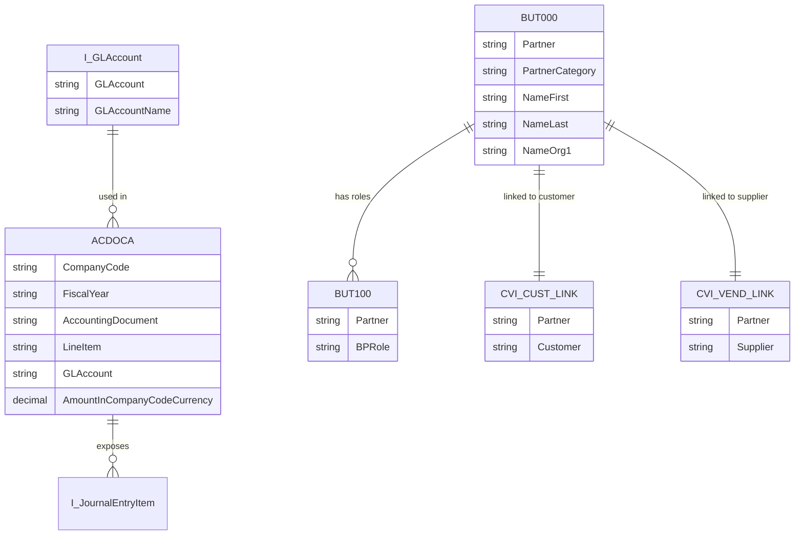

# SAP S/4HANA - FI/CO 模块数据库设计

## 概述

S/4HANA FI/CO 采用 Universal Journal (ACDOCA) 作为核心财务数据表，实现了总账、成本控制、资产会计和物料分类账的统一。

## Universal Journal (ACDOCA)

ACDOCA 是 S/4HANA 财务的核心表，整合了多个 ECC 表：

| ECC 来源 | ACDOCA 字段组 |
|---------|---------------|
| BKPF/BSEG | 凭证头/行项目 |
| GLT0 | 总账余额 |
| COEP | 成本控制行项目 |
| COSP/COSS | 成本控制总计 |
| ANEP | 资产行项目 |
| CKMLHD | 物料分类账 |

### ACDOCA 表结构

```sql
-- ACDOCA 核心字段

-- 键字段
RCLNT       CHAR(3)         -- 集团
RBUKRS      CHAR(4)         -- 公司代码
RYEAR       NUMC(4)         -- 会计年度
RACCT       CHAR(10)        -- 总账科目
RCLNT       CHAR(3)         -- 客户端
RLEDGER     CHAR(2)         -- Ledger
ROBJNR      CHAR(22)        -- 对象号
RCNTR       CHAR(10)        -- 成本中心
RPRCTR      CHAR(10)        -- 利润中心
RFAAREA     CHAR(16)        -- 功能范围
RSEGMENT    CHAR(10)        -- 段
RDEBCRE     CHAR(1)         -- 借/贷标识

-- 期间字段
POPER       NUMC(3)         -- 过账期间
FISCYEARPER CHAR(7)         -- 会计年度期间

-- 凭证字段
RDOCNUM     CHAR(10)        -- 凭证号
RLINENO     NUMC(6)         -- 行项目
RBTTYPE     CHAR(2)         -- 业务交易类型

-- 金额字段 (支持多币种)
HSL         CURR(23,2)      -- 本位币金额
TSL         CURR(23,2)      -- 交易货币金额
KSL         CURR(23,2)      -- 成本控制货币金额
OSL         CURR(23,2)      -- 对象货币金额
CSL         CURR(23,2)      -- 利润中心货币金额
GSL         CURR(23,2)      -- 全局货币金额
RSL         CURR(23,2)      -- 报表货币金额

-- 货币代码
RTCUR       CHAR(5)         -- 交易货币
RCURH       CHAR(5)         -- 本位币
RCURK       CHAR(5)         -- 成本控制货币
RCURO       CHAR(5)         -- 对象货币

-- 数量字段
MSL         QUAN(23,3)      -- 数量
RUNIT       CHAR(3)         -- 单位

-- 组织维度
RWCNTR      CHAR(10)        -- 工作分解结构
RASSC       CHAR(6)         -- 贸易伙伴
RPROJ_DEF   CHAR(24)        -- 项目定义
RORDER      CHAR(12)        -- 内部订单
RNETWORK    CHAR(12)        -- 网络
RACTIVITY   CHAR(4)         -- 活动类型
RWBSE       CHAR(24)        -- WBS 元素

-- 业务伙伴
RPARTNER    CHAR(10)        -- 业务伙伴
RCUSTOMER   CHAR(10)        -- 客户
RVENDOR     CHAR(10)        -- 供应商

-- 物料
RMATERIAL   CHAR(18)        -- 物料号
RPLANT      CHAR(4)         -- 工厂
RSTORAGE    CHAR(4)         -- 库存地点
RBATCH      CHAR(10)        -- 批次

-- 资产
RASSET      CHAR(12)        -- 资产号
RASSET_SUB  NUMC(4)         -- 资产子号

-- 日期
BUDAT       DATS            -- 过账日期
BLDAT       DATS            -- 凭证日期
AEDAT       DATS            -- 更改日期

-- 审计
ACTIVITY    CHAR(4)         -- 活动代码
ACCKEY      CHAR(3)         -- 科目键值
ORIGIN      CHAR(3)         -- 来源
```

## 主要 CDS Views

### 凭证相关

| CDS View | 说明 |
|----------|------|
| I_JournalEntry | 日记账条目 |
| I_JournalEntryItem | 日记账条目项目 |
| I_GLAccount | 总账科目 |
| I_CompanyCode | 公司代码 |
| I_FiscalYearPeriod | 会计年度期间 |

### 余额相关

| CDS View | 说明 |
|----------|------|
| I_GLAccountBalance | 总账科目余额 |
| I_CustomerBalance | 客户余额 |
| I_SupplierBalance | 供应商余额 |
| I_ProfitCenterBalance | 利润中心余额 |

### 业务伙伴相关

| CDS View | 说明 |
|----------|------|
| I_BusinessPartner | 业务伙伴 |
| I_Customer | 客户 |
| I_Supplier | 供应商 |
| I_BusinessPartnerAddress | BP 地址 |

### I_JournalEntryItem CDS View

```sql
@AbapCatalog.sqlViewName: 'I_JRNLENTRYITEM'
@AccessControl.authorizationCheck: #CHECK
@EndUserText.label: 'Journal Entry Item'
@VDM.viewType: #CONSUMPTION

define view I_JournalEntryItem
    as select from ACDOCA
{
    @EndUserText.label: 'Company Code'
    key RBUKRS as CompanyCode,

    @EndUserText.label: 'Fiscal Year'
    key RYEAR as FiscalYear,

    @EndUserText.label: 'Accounting Document'
    key RDOCNUM as AccountingDocument,

    @EndUserText.label: 'Line Item'
    key RLINENO as LineItem,

    @EndUserText.label: 'GL Account'
    RACCT as GLAccount,

    @EndUserText.label: 'Posting Date'
    BUDAT as PostingDate,

    @EndUserText.label: 'Document Date'
    BLDAT as DocumentDate,

    @EndUserText.label: 'Amount in Company Code Currency'
    HSL as AmountInCompanyCodeCurrency,

    @EndUserText.label: 'Company Code Currency'
    RCURH as CompanyCodeCurrency,

    @EndUserText.label: 'Amount in Transaction Currency'
    TSL as AmountInTransactionCurrency,

    @EndUserText.label: 'Transaction Currency'
    RTCUR as TransactionCurrency,

    @EndUserText.label: 'Debit/Credit'
    RDEBCRE as DebitCreditCode,

    @EndUserText.label: 'Cost Center'
    RCNTR as CostCenter,

    @EndUserText.label: 'Profit Center'
    RPRCTR as ProfitCenter,

    @EndUserText.label: 'Segment'
    RSEGMENT as Segment,

    @EndUserText.label: 'Functional Area'
    RFAAREA as FunctionalArea
}
```

## 业务伙伴 (BP) 模型

S/4HANA 强制使用业务伙伴 (BP) 模型，统一管理客户和供应商。

### BP 核心表

| 表名 | 说明 |
|------|------|
| BUT000 | 业务伙伴通用数据 |
| BUT001 | 业务伙伴-地址使用 |
| BUT020 | BP 地址 |
| BUT021 | BP 地址使用 |
| BUT030 | BP 行业部门 |
| BUT050 | BP 关系 |
| BUT051 | BP 关系类型 |
| BUT100 | BP 角色 |
| BUT101 | BP 角色文本 |
| CVI_CUST_LINK | 客户-BP 链接 |
| CVI_VEND_LINK | 供应商-BP 链接 |

### BUT000 结构

```sql
-- BUT000 主要字段
PARTNER         CHAR(10)    -- 业务伙伴号
PARTNER_GUID    RAW(16)     -- BP GUID
PARTNER_CAT     CHAR(1)     -- BP 类别 (1=组织, 2=个人, 3=组)
PARTNER_TYPE    CHAR(4)     -- BP 类型
BP_KIND         CHAR(2)     -- BP 种类
SOURCE          CHAR(10)    -- 来源
PARTNER_GRP     CHAR(4)     -- BP 分组
BP_GROUP        CHAR(4)     -- BP 组
CREATED_AT      DEC(15)     -- 创建时间
CHANGED_AT      DEC(15)     -- 更改时间
TITLE           CHAR(4)     -- 称谓
TITLE_ACA1      CHAR(4)     -- 学术称谓
TITLE_ACA2      CHAR(4)     -- 学术称谓 2
PREFIX1         CHAR(3)     -- 前缀 1
PREFIX2         CHAR(3)     -- 前缀 2
NAME_FIRST      CHAR(40)    -- 名
NAME_LAST       CHAR(40)    -- 姓
NAME_ORG1       CHAR(40)    -- 组织名 1
NAME_ORG2       CHAR(40)    -- 组织名 2
NAME_ORG3       CHAR(40)    -- 组织名 3
NAME_ORG4       CHAR(40)    -- 组织名 4
NAME_TEXT       CHAR(80)    -- 全名
NAME_GRP1       CHAR(40)    -- 组名 1
NAME_GRP2       CHAR(40)    -- 组名 2
LEGAL_ENTY      CHAR(4)     -- 法人实体
LEGAL_ORG       CHAR(4)     -- 法人组织
NATUR_TYP       CHAR(2)     -- 自然人类型
ISORG           CHAR(1)     -- 是否组织
BPKIND          CHAR(2)     -- BP 种类
NATIO           CHAR(3)     -- 国籍
LANGU           CHAR(1)     -- 语言
XDELE           CHAR(1)     -- 删除标识
XBLCK           CHAR(1)     -- 阻塞标识
AUGRP           CHAR(4)     -- 授权组
NOT_LNG         CHAR(1)     -- 非长期
```

### CVI_CUST_LINK 结构

```sql
-- 客户-BP 链接
PARTNER         CHAR(10)    -- BP 号
PARTNER_GUID    RAW(16)     -- BP GUID
CUSTOMER        CHAR(10)    -- 客户号
CUSTOMER_H      CHAR(10)    -- 客户头
BP_HEADER       CHAR(10)    -- BP 头
```

## 资产会计 (AA) 变化

S/4HANA 资产会计整合到 ACDOCA。

### 新资产表

| 表名 | 说明 |
|------|------|
| ACDOCA | 资产行项目 (整合) |
| IGLACCTBALANCE | 资产余额视图 |
| FAAT_DOC_IT | 资产文档项 |

### 兼容性视图

以下视图保持 ECC 兼容性：

| 视图名 | 说明 |
|--------|------|
| ANEP | 资产行项目 (视图) |
| ANLA | 资产主记录 (保留) |
| ANLC | 资产值字段 (视图) |

## 物料分类账 (ML) 变化

S/4HANA 物料分类账是强制功能。

### ML 核心表

| 表名 | 说明 |
|------|------|
| CKMLHD | 物料分类账头 |
| CKMLPP | 物料分类账期间 |
| CKMLCR | 物料分类账货币 |
| CKMLKE | 物料分类账成本核算 |
| ACDOCA | 整合物料数据 |

## Fiori 应用

### 核心财务 Fiori 应用

| 应用名称 | ECC 事务码 | Fiori ID |
|---------|-----------|----------|
| 显示总账科目余额 | FS10N | F1643 |
| 显示凭证明细 | FB03 | F0702 |
| 创建总账凭证 | FB01 | F0719 |
| 显示客户余额 | FD10N | F0295 |
| 显示供应商余额 | FK10N | F0296 |
| 资产浏览器 | AW01N | F1630 |
| 银行对账 | FF67 | F0291 |

## API 接口

### OData API

| API 名称 | 说明 |
|---------|------|
| API_GLACCOUNTIN_SERVIC | 总账科目 |
| API_JOURNALENTRY | 日记账条目 |
| API_COMPANYCODE | 公司代码 |
| API_BUSINESSPARTNER | 业务伙伴 |
| API_CUSTOMER | 客户 |
| API_SUPPLIER | 供应商 |
| API_FIXEDASSET | 固定资产 |

### API_JOURNALENTRY 示例

```
POST /sap/opu/odata/sap/API_JOURNALENTRY/JournalEntry

{
    "CompanyCode": "1000",
    "FiscalYear": "2024",
    "AccountingDocumentType": "SA",
    "DocumentDate": "2024-01-15",
    "PostingDate": "2024-01-15",
    "to_JournalEntryItem": [
        {
            "GLAccount": "0011000000",
            "AmountInCompanyCodeCurrency": "1000.00",
            "CompanyCodeCurrency": "CNY",
            "DebitCreditCode": "1"
        },
        {
            "GLAccount": "0011001000",
            "AmountInCompanyCodeCurrency": "1000.00",
            "CompanyCodeCurrency": "CNY",
            "DebitCreditCode": "2"
        }
    ]
}
```

## 表关系图



## 查询示例

### 获取科目余额

```sql
-- 使用 ACDOCA
SELECT
    RACCT AS GLAccount,
    SUM(CASE WHEN RDEBCRE = '1' THEN HSL ELSE -HSL END) AS Balance
FROM ACDOCA
WHERE RBUKRS = '1000'
  AND RYEAR = '2024'
  AND POPER <= '012'
GROUP BY RACCT;
```

### 获取凭证明细

```sql
-- 使用 CDS View
SELECT
    CompanyCode,
    FiscalYear,
    AccountingDocument,
    LineItem,
    GLAccount,
    AmountInCompanyCodeCurrency,
    DebitCreditCode
FROM I_JournalEntryItem
WHERE CompanyCode = '1000'
  AND FiscalYear = '2024'
  AND AccountingDocument = '100000001';
```

### 获取业务伙伴信息

```sql
-- 使用 BP 表
SELECT
    B1.PARTNER,
    B1.NAME_TEXT,
    B1.PARTNER_CAT,
    C.CUSTOMER,
    V.SUPPLIER
FROM BUT000 B1
LEFT JOIN CVI_CUST_LINK C ON B1.PARTNER = C.PARTNER
LEFT JOIN CVI_VEND_LINK V ON B1.PARTNER = V.PARTNER
WHERE B1.PARTNER = '0000000001';
```

## 参考资源

- SAP S/4HANA Financials: https://help.sap.com/docs/SAP_S4HANA_ON-PREMISE
- Universal Journal: https://help.sap.com/docs/SAP_S4HANA_ON-PREMISE
- SAP S/4HANA Cloud API Hub: https://api.sap.com/package/s4hanacloudallmodules
